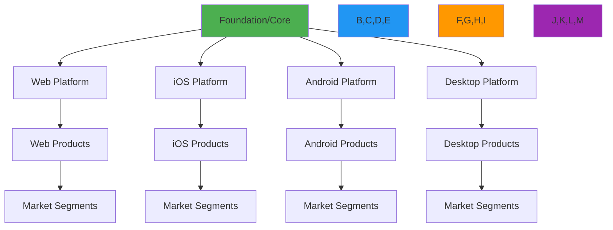
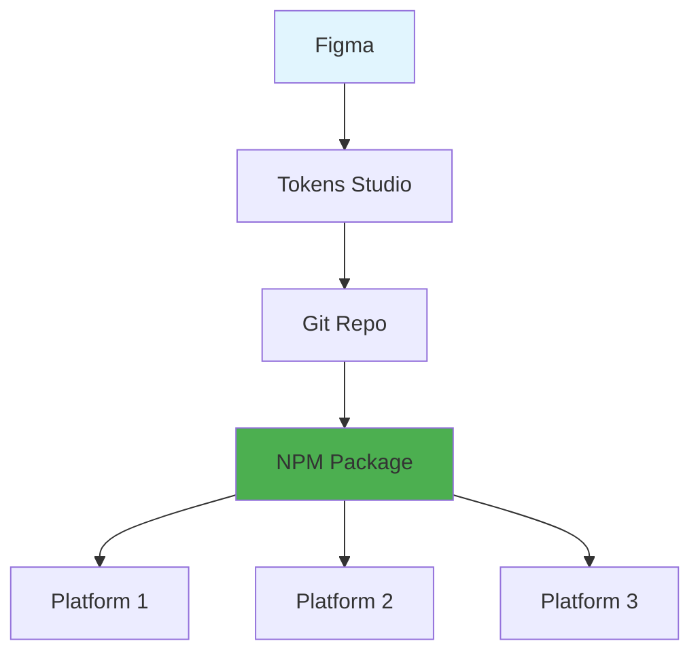
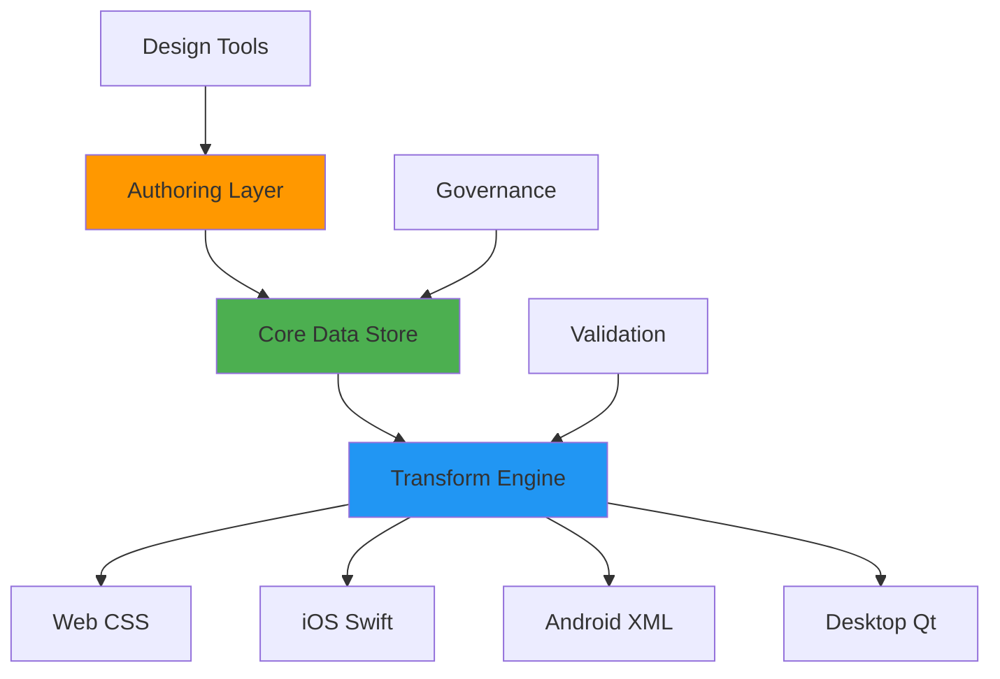
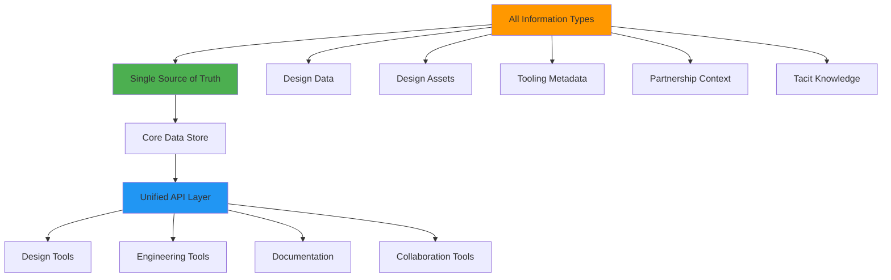
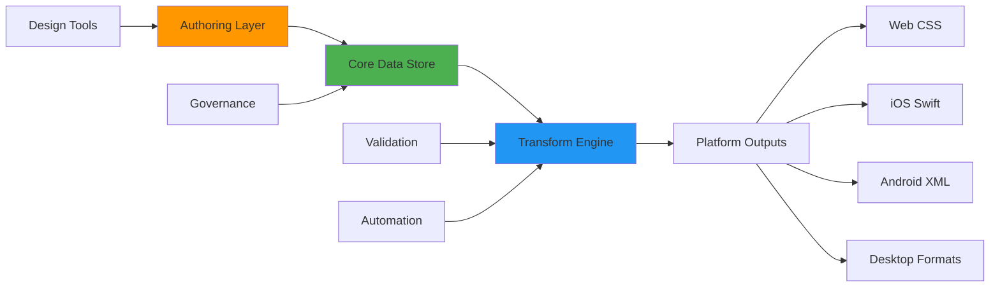

# Data System Model Overview

Beyond Tokens: How All the Pieces Fit Together

<div class="pt-12">
  <span @click="$slidev.nav.next" class="px-2 py-1 rounded cursor-pointer" hover="bg-white bg-opacity-10">
    Design Data Onsite 2025 • Garth Braithwaite
  </span>
</div>

<div class="abs-br m-6 flex gap-2">
  <button @click="$slidev.nav.openInEditor()" title="Open in Editor" class="text-xl slidev-icon-btn opacity-50 !border-none !hover:text-white">
    <carbon:edit />
  </button>
  <a href="https://github.com/slidevjs/slidev" target="_blank" alt="GitHub" title="Open in GitHub"
    class="text-xl slidev-icon-btn opacity-50 !border-none !hover:text-white">
    <carbon-logo-github />
  </a>
</div>

<!--
Welcome everyone to the Data System Model Overview. This is a critical conversation about how we think about design data beyond just tokens.

Today we'll explore both where we are and where we're headed.
-->

---
transition: fade-out
---

# What We'll Cover

<Toc minDepth="1" maxDepth="2"></Toc>

<!--
Here's what we'll walk through in the next 25 minutes
-->

---
layout: default
---

# The Current Reality

<v-clicks>

- **Tokens** are just the beginning
- **Multiple platforms** with different needs
- **Data flows** that are complex and sometimes unclear
- **Authoring challenges** that create friction
- **Implementation gaps** between design and engineering
- **Ambiguity** in system understanding and usage

</v-clicks>

<div class="mt-6" v-click>

## Key Pain Points We're Addressing
- **"What are tokens? What aren't tokens?"** - Designer confusion
- **Wayfinding issues** - Finding the right token for the use case
- **Customization complexity** - Implementation teams struggling
- **Figma integration gaps** - Design data not fully integrated

</div>

<div class="mt-8" v-click>

> "The model for the data system is much more than tokens"

</div>

<!--
Let's start with where we are today. We've built something valuable, but we're learning that our initial model needs to evolve.

[Click through each point]

The key insight here is that we started thinking about tokens, but the real challenge is the entire system of how design data flows through our organization.
-->

---
layout: two-cols
---

# Current Spectrum Token Workflow

```mermaid {theme: 'dark', scale: 0.7}
flowchart TD
    figma[Figma] 
    tokenStudio[Tokens Studio Data Git Repo]
    spectrumTokens[Spectrum Tokens Git Repo]
    spectrumTokensNPM[NPM Package @adobe/spectrum-tokens]
    spectrumIOS[Spectrum iOS]
    spectrumCSS[Spectrum CSS]
    drover[Drover]
    reactSpectrum[React Spectrum]
    spectrumWebComponents[Spectrum Web Components]
    spectrumQt[Qt]
    spectrumCSSTokens[@spectrum-css/tokens]

    figma -->|Tokens Studio Plugin| tokenStudio
    tokenStudio -->|Automated PR| spectrumTokens
    spectrumTokens --> spectrumTokensNPM
    spectrumTokensNPM --> spectrumIOS
    spectrumTokensNPM --> spectrumCSS
    spectrumCSS --> spectrumCSSTokens
    spectrumCSSTokens --> spectrumWebComponents
    spectrumCSS --> spectrumWebComponents
    spectrumTokensNPM --> drover
    spectrumTokensNPM --> reactSpectrum
    spectrumTokensNPM --> spectrumQt
    figma -->|Design Sync Meetings| reactSpectrum
    
    style figma fill:#e1f5fe
    style spectrumTokensNPM fill:#4CAF50
    style spectrumCSS fill:#f3e5f5
```

::right::

# Current Challenges

<v-clicks>

- **Tokens Studio dependency** creates bottleneck
- **Multiple manual sync points** (Design Sync Meetings)
- **Platform-specific transformations** happen downstream
- **Limited governance** in the authoring process
- **Figma integration gaps** noted in pain points
- **Complex dependency chain** for updates

</v-clicks>

<!--
This diagram shows our current state - a lot of manual handoffs and potential points of failure.

The right side shows the core challenges we're trying to solve. Each of these represents real friction our teams experience daily.
-->

---
layout: default
---

# The Information Scattering Problem

<div class="grid grid-cols-2 gap-8 mt-8">

<div>

## Where Design System Information Lives Today
<v-clicks>

- **Design Data**: Tokens, Component APIs, Anatomy
- **Design Assets**: S2 Specs, Figma libraries  
- **Tooling**: LLM, MCP, Linting, Visual Diff, Metrics
- **Documentation**: Website, Engineering docs, Training
- **Partnership**: Slack messages, Meetings, Workshops
- **Assumptions**: Undocumented, tacit knowledge

</v-clicks>

</div>

<div v-click="7">

## The Core Problem
- **Information is scattered** across dozens of locations
- **No single source of truth** for system knowledge
- **Tacit knowledge** lives in people's heads
- **Context switching** between tools slows teams down
- **Inconsistent formats** make automation difficult
- **New team members** struggle to find information

</div>

</div>

<div class="mt-8" v-click="8">

> **Interactive Visualization**: [Circle-packing diagram](./circle-packing-demo/circle-packing.html) shows the full scope of scattered information

</div>

<!--
The circle-packing visualization reveals that our design system information is distributed across many different locations and formats. This scattering is a major source of friction.
-->

---
layout: default
---

# Beyond Tokens: The Complete System

<div class="grid grid-cols-3 gap-6 mt-8">

<div v-click="1">

## Design Data & Assets
- **Design Tokens** (Global → Base → Alias)
- **Component Specifications** 
- **Figma Libraries** (variables, styles, components)
- **Component Anatomy** definitions

</div>

<div v-click="2">

## Tooling Ecosystem
- **LLM Integration** for assistance
- **MCP** (Model Context Protocol)
- **Linting & Validation**
- **Visual Diff** for changes
- **Metrics & Analytics**
- **CI/CD Automation**

</div>

<div v-click="3">

## Partnership & Documentation
- **Spectrum Design Website**
- **Engineering Documentation**
- **Training Materials**
- **Slack Integration** (QOTD, Help)
- **Design Workshops**
- **Regular Partnership Meetings**

</div>

</div>

<!--
The Slack Canvas revealed that our system is much more comprehensive than just tokens and data flow. We're building an entire ecosystem.
-->

---
layout: center
class: text-center
---

# The Aspirational Model

## A Multi-Platform System of Systems

<div class="text-6xl text-blue-400 mt-8">
  🏗️
</div>

<!--
Now let's talk about where we want to go. This isn't just about fixing what we have - it's about reimagining how design data should work at Adobe scale.
-->

---
layout: default
---

# The Pyramid Model



<!--
This is our proposed hierarchy. Think of it like a pyramid where:

- Foundation/Core is at the top - cross-platform and semantic
- Platform layers in the middle - 4 main platforms
- Product layers at the bottom
- Market segments as needed

Key principle: As you go down, you get more data and more specificity, but the layers above don't need to track everything below.
-->

---
layout: two-cols
---

# Data Flow Principles

<v-clicks>

## Downward Flow
- Each layer **pulls from above**
- **Override capability** at each level
- **Filter unused data** as needed

## Upward Flow  
- Submit changes **via request**
- **Governance process** for core changes
- **Platform-specific additions** stay local

</v-clicks>

::right::

<div v-click="3">

## Schema Benefits

```typescript
interface LayerSchema {
  source: "core" | "platform" | "product"
  overrides: DataOverride[]
  extensions: PlatformData[]
  transforms: AutomationRule[]
}
```

<div class="mt-4 text-sm text-gray-400">
Each layer would benefit from schema that enables automation
</div>

</div>

<!--
This shows how data should flow in both directions. The key insight is that we need both pull and push mechanisms, with proper governance.

The schema concept on the right enables automation - imagine parsers and transformers that understand the structure.
-->

---
layout: default
---

# Multi-Platform in Practice

<div class="grid grid-cols-2 gap-8 mt-8">

<div>

## Platform Needs
<v-clicks>

- **Web**: CSS variables, component tokens
- **iOS**: Swift constants, semantic naming
- **Android**: XML resources, material tokens  
- **Desktop**: Platform-specific formats

</v-clicks>

</div>

<div>

## Shared Benefits
<v-clicks>

- **Common schemas** for transformation
- **Shared tooling** for authoring
- **Consistent governance** process
- **Cross-platform collaboration**

</v-clicks>

</div>

</div>

<div class="mt-8" v-click>

> Each platform can solve this independently, but collaboration on schemas and tooling benefits everyone

</div>

<!--
Here's the practical reality - each platform has different technical needs, but we can share the hard parts like schemas and governance.

This isn't about forcing uniformity, it's about smart collaboration where it makes sense.
-->

---
layout: default
---

# Component Token Relationships (CTR)

<div class="grid grid-cols-2 gap-8 mt-8">

<div>

## The Challenge
<v-clicks>

- **Many-to-many relationships** between components and tokens
- **Adaptive functions** for different contexts
- **Unique instance information** about components
- **Which part** of component is being defined
- **Which property** of that part is described
- **Which token** provides the value

</v-clicks>

</div>

<div>

## The Solution: CTR
<v-clicks>

```typescript
interface ComponentTokenRelation {
  component: ComponentRef
  part: ComponentPart
  property: PropertyType
  token: TokenRef
  context?: ContextInfo
  transform?: Function
}
```

**Benefits:**
- Adaptive, context-aware mappings
- Pure function relationships
- Multi-platform customization
- Reduced manual maintenance

</v-clicks>

</div>

</div>

<!--
This is the technical foundation for how we think about component-token relationships. It's more sophisticated than simple name-based mappings.
-->

---
layout: default
---

# Current vs. Aspirational Model

<div class="grid grid-cols-2 gap-8 mt-8">

<div>

## Current: Linear Chain


**Issues:**
- Single point of failure
- Platform needs not considered early
- Limited governance and validation

</div>

<div>

## Aspirational: Hub & Spoke


**Benefits:**
- Platform-aware from the start
- Built-in governance and validation
- Flexible, extensible architecture

</div>

</div>

<!--
This side-by-side comparison shows the fundamental shift we're proposing - from a linear chain to a hub-and-spoke model that serves all platforms effectively.
-->

---
layout: default
---

# Aspirational: Unified Information Architecture



<div class="mt-6" v-click>

## Key Benefits of Unification
- **Centralized discovery** - one place to find all system information
- **Consistent formats** enable automation and AI integration
- **Reduced context switching** between tools and locations
- **Faster onboarding** for new team members
- **Better collaboration** through shared context

</div>

<!--
Instead of scattered information, we envision a unified architecture where all design system information flows through a single source of truth with consistent APIs.
-->

---
layout: default
---

# Data Input & Output Strategy



<!--
This diagram shows our vision for how data flows through the system:

- Authoring layer handles the complexity of data entry
- Core data store is the single source of truth
- Transform engine handles platform-specific outputs
- Governance and validation ensure quality

The key is that platforms get exactly what they need, in the format they need.
-->

---
layout: two-cols
---

# Addressing Current Authoring Pain Points

<div class="grid grid-cols-2 gap-8 mt-8">

<div>

## Current Issues with Tokens Studio
<v-clicks>

- **Third-party dependency** creates risk
- **Figma not fully integrating** with our design data
- **Complex authoring process** for spec files  
- **Limited governance** in the workflow
- **Manual sync meetings** required for React Spectrum

</v-clicks>

</div>

<div>

## Proposed Solutions
<v-clicks>

- **Native authoring tools** reduce dependency risk
- **Integrated Figma workflow** with better design data sync
- **Automated spec generation** from structured data
- **Built-in governance** at authoring time
- **API-driven sync** replaces manual meetings

</v-clicks>

</div>

</div>

<div class="mt-8" v-click>

> **Goal**: Reduce friction while increasing quality and governance

</div>

<!--
These are the specific pain points we heard in the Slack Canvas discussion. Our new model should directly address each of these issues.
-->

---
layout: two-cols
---

# Authoring at Point of Use

<v-clicks>

## The Goal
- Edit where you use the data
- Immediate feedback on changes
- Context-aware authoring tools

## The Challenge  
- Technical complexity
- Performance implications
- Cross-platform synchronization

</v-clicks>

::right::

<div v-click="4">

## Compromise Solutions

```markdown
1. **Smart defaults** from core
2. **Local override** capabilities  
3. **Sync on demand** not real-time
4. **Clear ownership** boundaries
```

<div class="mt-4 p-4 bg-yellow-100 dark:bg-yellow-900 rounded">
⚠️ "Author at point of use" may require compromise, but we can get close
</div>

</div>

<!--
One of our aspirational goals is to enable editing where you use the data. This is challenging but valuable.

The compromise solutions on the right show how we might achieve most of the benefits without the full complexity.
-->

---
layout: default
---

# Implementation Roadmap

<div class="grid grid-cols-3 gap-6 mt-8">

<div v-click="1">

## Phase 1: Foundation
- Establish core data schemas
- Build governance process  
- Create transformation pipeline
- **Reduce Tokens Studio dependency**
- Pilot with one platform

</div>

<div v-click="2">

## Phase 2: Platform Expansion
- Extend to all 4 platforms
- Build authoring tools
- Implement override systems
- Cross-platform validation

</div>

<div v-click="3">

## Phase 3: Optimization
- Point-of-use authoring
- Advanced automation
- Performance optimization
- Full ecosystem integration

</div>

</div>

<div class="mt-8" v-click="4">

> **Target**: Phase 1 complete by end of 2025, Phase 2 by mid-2026

</div>

<!--
This roadmap shows how we might approach this transformation. We're not trying to boil the ocean - we start with solid foundations and build incrementally.

The timeline is aspirational but gives us concrete milestones to work toward.
-->

---
layout: default
---

# Success Metrics

<div class="grid grid-cols-2 gap-8 mt-8">

<div>

## Team Efficiency
<v-clicks>

- **Reduce manual token updates** by 80%
- **Faster platform onboarding** (weeks → days)
- **Consistent implementation** across platforms
- **Reduced support requests**
- **Faster information discovery** (minutes → seconds)
- **Reduced context switching** between tools

</v-clicks>

</div>

<div>

## System Quality  
<v-clicks>

- **Single source of truth** for all platforms AND information types
- **Automated validation** catches errors early
- **Version control** for all design data
- **Clear governance** for changes
- **Centralized knowledge** reduces information loss
- **Consistent formats** enable AI integration

</v-clicks>

</div>

</div>

<div class="mt-8" v-click>

> The goal isn't just efficiency - it's enabling teams to focus on higher-value work

</div>

<!--
These metrics help us measure success. Notice we're not just looking at speed - we want quality improvements that enable better work.

The bottom line is about freeing teams to focus on design and product innovation instead of data management.
-->

---
layout: two-cols
---

# Questions for Discussion

<v-clicks>

## Immediate
- Which platform should we pilot first?
- What governance structure makes sense?
- How do we handle the transition period?
- How do we better integrate Figma with our design data?

## Strategic
- How does this align with Adobe's broader platform strategy?
- What partnerships do we need?
- How do we measure ROI?
- How do we solve the "What are tokens?" wayfinding problem?

</v-clicks>

::right::

<div v-click="4">

## Next Steps

1. **Validate** the pyramid model with platform teams
2. **Prototype** the transformation pipeline  
3. **Define** governance process
4. **Select** pilot platform and timeline

<div class="mt-6 p-4 bg-blue-100 dark:bg-blue-900 rounded">
💡 **Today's goal**: Get alignment on the overall direction
</div>

</div>

<!--
These are the key questions we need to tackle as a team. Some we can answer today, others will require more research and planning.

The next steps on the right give us concrete actions coming out of this presentation.
-->

---
layout: center
class: text-center
---

# References & Resources

<div class="grid grid-cols-2 gap-8 mt-8">

<div>

## Planning Documents
- **Onsite Planning**: [Dropbox Paper Doc](https://paper.dropbox.com/doc/Design-Data-Onsite-Planning-2025--CqW0j_fWBNR4674G3pzkNfvwAg-dpoZHJfX6xGhsmZOEj0X6)
- **Figma Design Model**: [Design data system model](https://www.figma.com/design/FN7Lm9DOW2vPlUQfXESCv5/Design-data-system-model?node-id=1-179&t=mFxjYG7ngqFI0It5-1)
- **Slack Canvas**: Brainstorm & planning notes

</div>

<div>

## Key Contributors
- **Aaron Brownlee** (@brownlee) - Goals & Strategy
- **Nate Baldwin** (@nbaldwin) - Pain Points & Aspirational Model  
- **Garth Braithwaite** (@garthdb) - Engineering Strategy
- **Team Collaboration** - Multi-platform insights

</div>

</div>

<!--
These are the key resources and people that informed this presentation. The Figma design model is particularly valuable for visualizing the concepts.
-->

---
layout: center
class: text-center
---

# Thank You

## Questions & Discussion

<div class="text-4xl text-blue-400 mt-8">
  🤝
</div>

<div class="mt-8">
Garth Braithwaite • Design Data Onsite 2025
</div>

<!--
Thank you everyone. I'm looking forward to the discussion and hearing your thoughts on this model.

The success of this system depends on all of our platforms working together effectively.
-->
