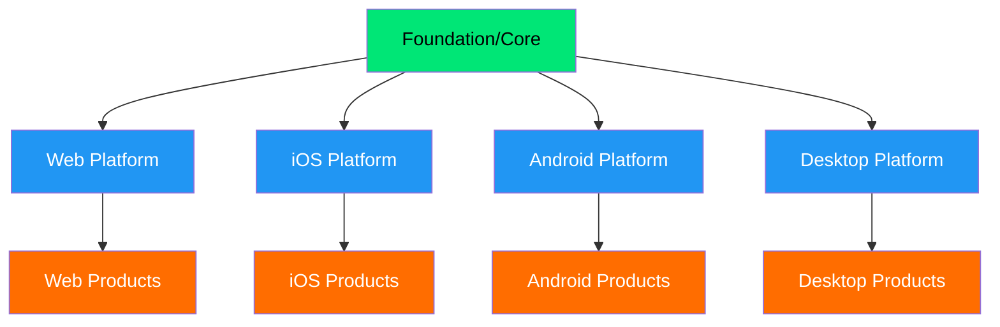
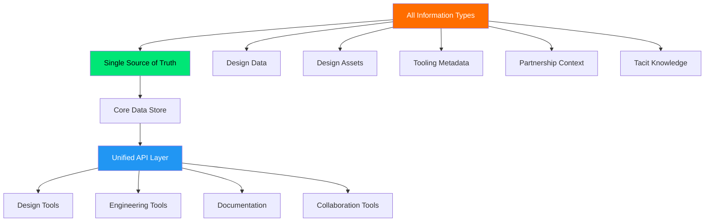
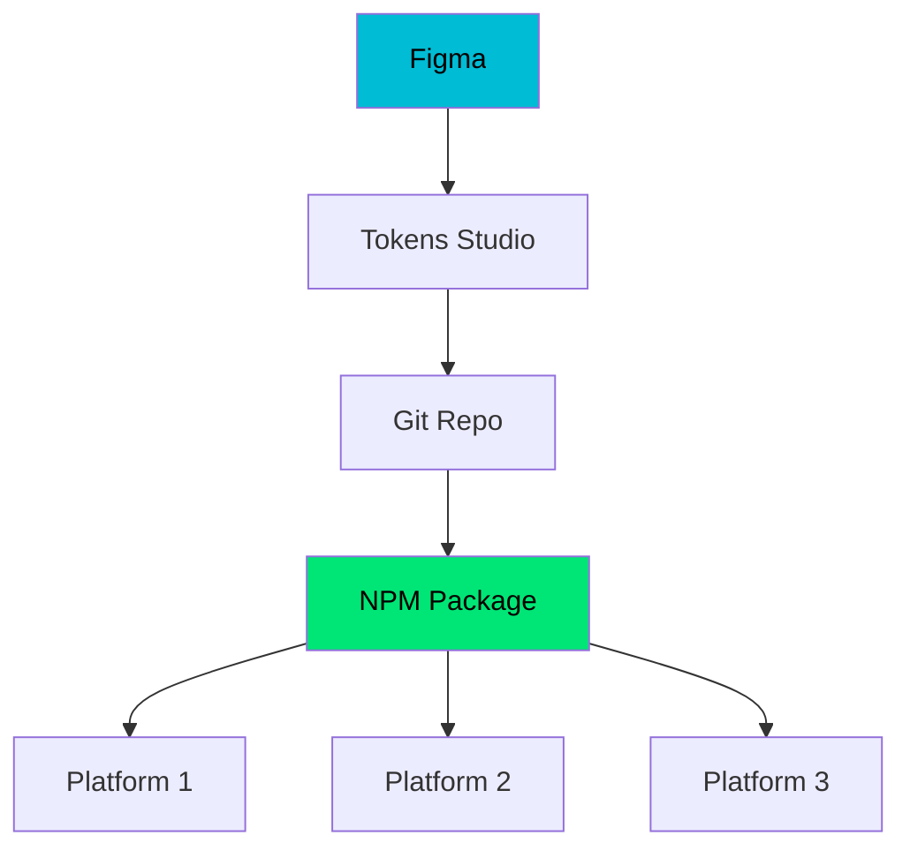
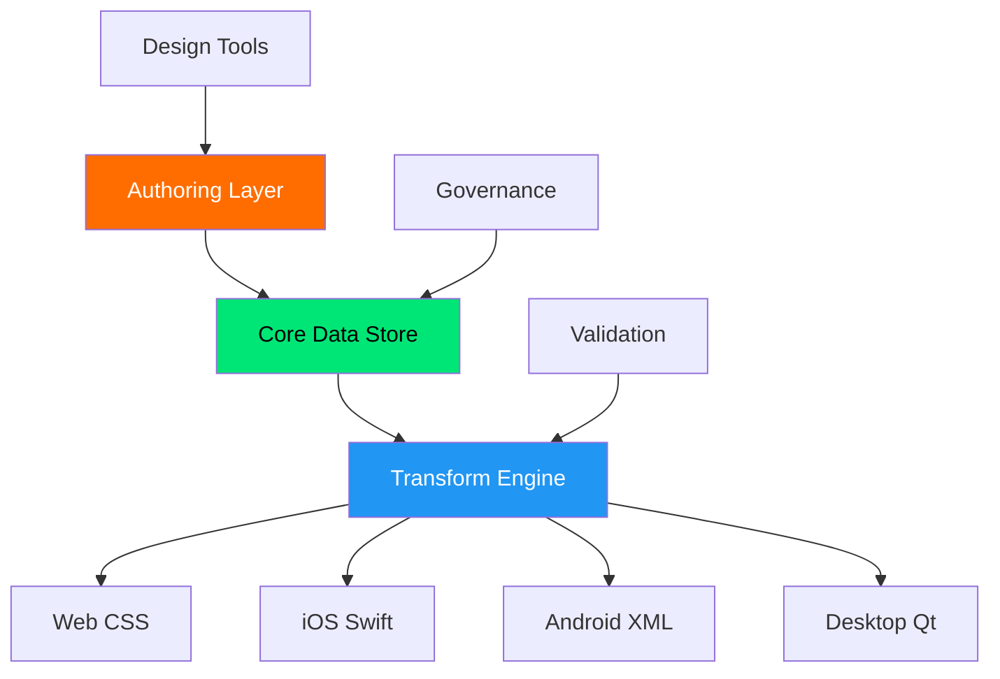

# Data System Model Overview

Beyond Tokens: How All the Pieces Fit Together

<div class="pt-12">
  <span @click="$slidev.nav.next" class="px-2 py-1 rounded cursor-pointer" hover="bg-white bg-opacity-10">
    Day 1 • Garth Braithwaite • 25 minutes
  </span>
</div>

<div class="abs-br m-6 flex gap-2">
  <button @click="$slidev.nav.openInEditor()" title="Open in Editor" class="text-xl slidev-icon-btn opacity-50 !border-none !hover:text-white">
    <carbon:edit />
  </button>
</div>

<!--
Welcome everyone to the Data System Model Overview. This is a critical conversation about how we think about design data beyond just tokens.

Today we'll explore both where we are and where we're headed.
-->

---
transition: fade-out
---

# What We'll Cover (25 minutes)

<div class="text-sm leading-tight">
<Toc minDepth="1" maxDepth="2"></Toc>
</div>

<!--
Here's what we'll walk through in the next 25 minutes
-->

---
layout: default
---

# Spectrum Tokens: A Brief History

<div class="grid grid-cols-2 gap-8 mt-8">

<div>

## Release Statistics (3 Years)

<v-clicks>

- **220 Total Releases** - High velocity development
- **84 Legacy Releases** - Foundation work  
- **51 Stable Releases** - Production-ready updates
- **61 Beta Releases** - Feature previews
- **24 Snapshot Releases** - Development builds
- **11 Development Features** - Experimental work

</v-clicks>

</div>

<div>

## What This Shows Us

<v-clicks>

- **Rapid iteration** - Multiple releases per month
- **Mature process** - Clear release categorization  
- **Active development** - Consistent feature delivery
- **Scale challenge** - 220 releases = lots of information to track

</v-clicks>

<div class="mt-6" v-click>

> **Interactive Timeline**: [View release history](http://localhost:8081/docs/release-timeline/) shows the full release patterns over time

</div>

</div>

</div>

<!--
This historical context shows why we need better data systems - with 220 releases across multiple categories, manual tracking becomes impossible. The high velocity of releases makes our current scattered information problem even more acute.
-->

---
layout: default
---

# The Information Scattering Problem

<div class="grid grid-cols-2 gap-8 mt-8">

<div>

## Where Design System Information Lives Today
<v-clicks>

- **Design Data**: Tokens, Component APIs, Anatomy
- **Design Assets**: S2 Specs, Figma libraries  
- **Tooling**: LLM, MCP, Linting, Visual Diff, Metrics
- **Documentation**: Website, Engineering docs, Training
- **Partnership**: Slack messages, Meetings, Workshops
- **Assumptions**: Undocumented, tacit knowledge

</v-clicks>

</div>

<div v-click="7">

## The Core Problem
- **Information is scattered** across dozens of locations
- **No single source of truth** for system knowledge
- **Tacit knowledge** lives in people's heads
- **Context switching** between tools slows teams down
- **Inconsistent formats** make automation difficult
- **New team members** struggle to find information

</div>

</div>

<div class="mt-8" v-click="8">

> **Interactive Visualization**: [Circle-packing diagram](http://localhost:8080/circle-packing.html) shows the full scope of scattered information

</div>

<!--
The circle-packing visualization reveals that our design system information is distributed across many different locations and formats. This scattering is a major source of friction.
-->

---
layout: default
---

# The Current Reality: Designer Workflow Complexity

<div class="grid grid-cols-2 gap-6 mt-4 text-sm">

<div>

## S2 Figma Spec Workflow Today
<v-clicks>

**Each component page has:**
- Manual "Token definition" artboards
- Hand-maintained token lists
- No automated change tracking
- Disconnected from code implementation

```yaml
# Designers struggle with naming
button-minimum-height-small: "32px"
slider-handle-border-width-down-small: "7px"
```

**Critical Problems:**
- **Hard to know how to name new tokens**
- **Difficult to find existing tokens to reuse**
- **Manual Figma file maintenance**
- **No changelog for spec updates**

</v-clicks>

</div>

<div>

## Real Pain Points from Design Team
<v-clicks>

- **"Finding the right token - name/value/everything"** - Universal wayfinding problem
- **"Truth in too many places"** - Figma, Excel, spec files, code
- **"Everything is unique"** vs. system consistency
- **Token naming is hard** - no guidance for new tokens
- **Semantic alias creation** - complex decisions without structure
- **Manual spec maintenance** - tedious, error-prone process
- **Implementation gaps** - engineers reading Figma specs manually

</v-clicks>

</div>

</div>

<div class="mt-4" v-click>

> **The Vision**: Move from manual maintenance to automated, structured authoring

</div>

<!--
Let's start with where we are today. We've built something valuable, but we're learning that our initial model needs to evolve.

[Click through each point]

The key insight here is that we started thinking about tokens, but the real challenge is the entire system of how design data flows through our organization.
-->

---
layout: two-cols
---

# Current Spectrum Token Workflow

```mermaid {theme: 'dark', scale: 0.5}
flowchart TD
    figma[Figma] 
    tokenStudio[Tokens Studio Data Git Repo]
    spectrumTokens[Spectrum Tokens Git Repo]
    spectrumTokensNPM[NPM Package @adobe/spectrum-tokens]
    spectrumIOS[Spectrum iOS]
    spectrumCSS[Spectrum CSS]
    drover[Drover]
    reactSpectrum[React Spectrum]
    spectrumWebComponents[Spectrum Web Components]
    spectrumQt[Qt]
    spectrumCSSTokens[@spectrum-css/tokens]

    figma -->|Tokens Studio Plugin| tokenStudio
    tokenStudio -->|Automated PR| spectrumTokens
    spectrumTokens --> spectrumTokensNPM
    spectrumTokensNPM --> spectrumIOS
    spectrumTokensNPM --> spectrumCSS
    spectrumCSS --> spectrumCSSTokens
    spectrumCSSTokens --> spectrumWebComponents
    spectrumCSS --> spectrumWebComponents
    spectrumTokensNPM --> drover
    spectrumTokensNPM --> reactSpectrum
    spectrumTokensNPM --> spectrumQt
    figma -->|Design Sync Meetings| reactSpectrum
    
    style figma fill:#00BCD4,color:#000000
    style spectrumTokensNPM fill:#00E676,color:#000000
    style spectrumCSS fill:#AB47BC,color:#FFFFFF
```

::right::

<div class="text-xs">

## Key Challenges

<v-clicks>

- **Tokens Studio bottleneck**
- **Multiple manual sync points**
- **Downstream transformations**
- **Limited governance**
- **Figma integration gaps**
- **Complex dependency chain**

</v-clicks>

</div>

<!--
This diagram shows our current state - a lot of manual handoffs and potential points of failure.

The right side shows the core challenges we're trying to solve. Each of these represents real friction our teams experience daily.
-->

---
layout: default
---

# Progress Toward Structured Data

<div class="grid grid-cols-2 gap-8 mt-8">

<div>

## What We've Completed ✅
<v-clicks>

- **Token Structure** with typing, schema, validation
- **Component Options API** - all options codified
- **Automated testing** and alignment with Tokens Studio
- **Static website** generating component option tables
- **Schema foundations** in progress

</v-clicks>

</div>

<div>

## What's Next 🚧
<v-clicks>

- **Component Token Relationships** (the missing piece)
- **Token name structure** improvements
- **Lexicon Optimization** - reduce/standardize vocabulary in naming
- **Figma workflow** to find all tokens per component
- **Deprecation strategy** for old patterns
- **Authoring workflow** for designers

</v-clicks>

</div>

</div>

<div class="mt-8" v-click>

> **Key Insight**: We're not starting from scratch - we're completing a multi-year vision

</div>

<!--
This shows we've been building toward this vision systematically and have real progress to show.
-->

---
layout: image
image: ./Design Data Complexity/Design Data Complexity.001.png
---

<!--
This slide shows the complexity we're dealing with in our current design system. The image reveals the intricate web of relationships that we're trying to systematize and automate.
-->

---
layout: image
image: ./Design Data Complexity/Design Data Complexity.002.png
---

<!--
This slide shows our proposed solution framework that addresses the complexity. The structured approach transforms the chaotic web into organized, manageable relationships.
-->

---
layout: default
---

# The Vision: Solving Designer Workflow Problems

<div class="grid grid-cols-2 gap-8 mt-8">

<div>

## Instead of Manual Token Naming
```yaml
# Confusing for designers to create
slider-handle-border-width-down-small: "7px"
```

**Current designer experience:**
- How do I name this token?
- Does a similar token already exist?
- What's the semantic alias structure?
- Where do I document this change?

</div>

<div>

## Structured Component Token Relations
```yaml
id: 683fb538-290c-423f-990b-d7134e485f51
$schema: adobe/spectrum/schema/0.0.0/token-types/dimension.yml
component: slider
part: handle
property: border-width
value: 7px
options:
  state: down
  size: small
```

**New designer experience:**
- Pick component from validated list
- Select part from anatomy definitions
- Choose property from allowed options  
- System suggests existing tokens automatically

</div>

</div>

<div class="grid grid-cols-3 gap-6 mt-8" v-click>

<div>

## Enabled by Component Options
- **Design team authoring** component options (in progress)
- **Guided token creation** with validation
- **Automatic semantic alias suggestions**

</div>

<div>

## Enabled by Component Anatomy  
- **Part definitions** (handle, track, etc.)
- **Property mappings** (border-width, background, etc.)
- **Token reuse recommendations**

</div>

<div>

## Benefits for Designers
- **No more naming confusion**
- **Automatic spec generation**
- **Built-in changelog tracking**
- **Figma-to-code synchronization**

</div>

</div>

<!--
This is the core vision - moving from strings to structured, typed objects that can be validated and automatically transformed.
-->

---
layout: default
---

# How This Transforms the S2 Spec Workflow

<div class="grid grid-cols-2 gap-4 mt-2 text-xs leading-tight">

<div>

## Current S2 Workflow (Manual)
<v-clicks>

1. **Designer creates component variant** in Figma
2. **Manually creates "Token definition" artboard**
3. **Manually lists tokens** with copy/paste naming
4. **No validation** of token names or values  
5. **Manual maintenance** when tokens change
6. **No changelog** tracking updates
7. **Engineers read specs manually** and implement

**Time per component:** ~2-4 hours of manual work

</v-clicks>

</div>

<div>

## Future Structured Workflow (Automated)  
<v-clicks>

1. **Designer creates component variant** in Figma
2. **Structured authoring tool** guides token creation
3. **System suggests existing tokens** or helps create new ones
4. **Automatic validation** against schema and anatomy
5. **Automatic spec generation** from structured data
6. **Changelog automatically generated** from data changes
7. **Engineers consume via API** with type safety

**Time per component:** ~15-30 minutes with better quality

</v-clicks>

</div>

</div>

<div class="mt-2" v-click>

> **Result**: 80% time reduction + higher quality + automatic maintenance

</div>

<!--
This concrete comparison shows exactly how Design team workflow improves with structured data.
-->

---
layout: center
class: text-center
---

# The Aspirational Model

## A Multi-Platform System of Systems

<div class="text-6xl text-blue-400 mt-8">
  🏗️
</div>

<!--
Now let's talk about where we want to go. This isn't just about fixing what we have - it's about reimagining how design data should work at Adobe scale.
-->

---
layout: default
---

# The Pyramid Model



<!--
This is our proposed hierarchy. Think of it like a pyramid where:

- Foundation/Core is at the top - cross-platform and semantic tokens
- Platform layers in the middle - 4 main platforms with platform-specific adaptations
- Product layers at the bottom - product-specific implementations

Key principle: As you go down, you get more data and more specificity, but the layers above don't need to track everything below. This creates a clean separation of concerns that matches how Spectrum actually works.
-->

---
layout: default
---

# Aspirational: Unified Information Architecture



<div class="mt-6" v-click>

## Key Benefits of Unification
- **Centralized discovery** - one place to find all system information
- **Consistent formats** enable automation and AI integration
- **Reduced context switching** between tools and locations
- **Faster onboarding** for new team members
- **Better collaboration** through shared context

</div>

<!--
Instead of scattered information, we envision a unified architecture where all design system information flows through a single source of truth with consistent APIs.
-->

---
layout: default
---

# Current vs. Aspirational Model

<div class="grid grid-cols-2 gap-8 mt-8">

<div>

## Current: Linear Chain


**Issues:**
- Single point of failure
- Platform needs not considered early
- Limited governance and validation

</div>

<div>

## Aspirational: Hub & Spoke


**Benefits:**
- Platform-aware from the start
- Built-in governance and validation
- Flexible, extensible architecture

</div>

</div>

<!--
This side-by-side comparison shows the fundamental shift we're proposing - from a linear chain to a hub-and-spoke model that serves all platforms effectively.
-->

---
layout: default
---

# Implementation Roadmap: Solving Designer Pain Points

<div class="grid grid-cols-3 gap-6 mt-8">

<div v-click="1">

## Phase 1: Foundation & Figma Integration
- **Complete Component Options authoring** (design team)
- **Establish Component Anatomy** definitions
- **Build CTR object schemas** and validation
- **Figma authoring workflow** with structured guidance
- **Automated S2 spec generation** (replacing manual artboards)
- **Pilot with one component** (Button or Slider)

</div>

<div v-click="2">

## Phase 2: Designer Workflow Revolution
- **Migrate all components** to CTR objects
- **Smart token suggestions** during authoring
- **Automatic semantic alias creation**
- **Real-time changelog generation**
- **Eliminate manual spec file maintenance**
- **Reduce naming decisions** by 90%

</div>

<div v-click="3">

## Phase 3: AI-Powered Design Data
- **AI-assisted token authoring** with context awareness
- **Automatic pattern recognition** for token reuse
- **Cross-component consistency** validation
- **Real-time Figma-to-code** synchronization
- **Intelligent design system guidance**

</div>

</div>

<div class="mt-8" v-click="4">

> **Target for Design team**: Phase 1 pilot by Q2 2025, full Phase 2 by end of 2025

</div>

<!--
This roadmap shows how we might approach this transformation. We're not trying to boil the ocean - we start with solid foundations and build incrementally.

The timeline is aspirational but gives us concrete milestones to work toward.
-->

---
layout: default
---

# Success Metrics

<div class="grid grid-cols-2 gap-8 mt-8">

<div>

## Team Efficiency
<v-clicks>

- **Reduce manual token updates** by 80%
- **Faster platform onboarding** (weeks → days)
- **Consistent implementation** across platforms
- **Reduced support requests**
- **Faster information discovery** (minutes → seconds)
- **Reduced context switching** between tools

</v-clicks>

</div>

<div>

## System Quality  
<v-clicks>

- **Single source of truth** for all platforms AND information types
- **Automated validation** catches errors early
- **Version control** for all design data
- **Clear governance** for changes
- **Centralized knowledge** reduces information loss
- **Consistent formats** enable AI integration

</v-clicks>

</div>

</div>

<div class="mt-8" v-click>

> The goal isn't just efficiency - it's enabling teams to focus on higher-value work

</div>

<!--
These metrics help us measure success. Notice we're not just looking at speed - we want quality improvements that enable better work.

The bottom line is about freeing teams to focus on design and product innovation instead of data management.
-->

---
layout: two-cols
---

# Questions for Discussion

<v-clicks>

## Immediate
- Which platform should we pilot first?
- What governance structure makes sense?
- How do we handle the transition period?
- How do we better integrate Figma with our design data?

## Strategic
- How does this align with Adobe's broader platform strategy?
- What partnerships do we need?
- How do we measure ROI?
- How do we solve the "What are tokens?" wayfinding problem?

</v-clicks>

::right::

<div v-click="4">

## Next Steps

1. **Validate** the pyramid model with platform teams
2. **Prototype** the transformation pipeline  
3. **Define** governance process
4. **Select** pilot platform and timeline

<div class="mt-6 p-4 bg-blue-100 dark:bg-blue-900 rounded">
💡 <strong>Today's goal</strong>: Get alignment on the overall direction
</div>

</div>

<!--
These are the key questions we need to tackle as a team. Some we can answer today, others will require more research and planning.

The next steps on the right give us concrete actions coming out of this presentation.
-->

---
layout: center
class: text-center
---

# Thank You

## Questions & Discussion

<div class="text-4xl text-blue-400 mt-8">
  🤝
</div>

<div class="mt-8">
Garth Braithwaite • Design Data Onsite 2025 • Day 1
</div>

<!--
Thank you everyone. I'm looking forward to the discussion and hearing your thoughts on this model.

The success of this system depends on all of our platforms working together effectively.
-->
