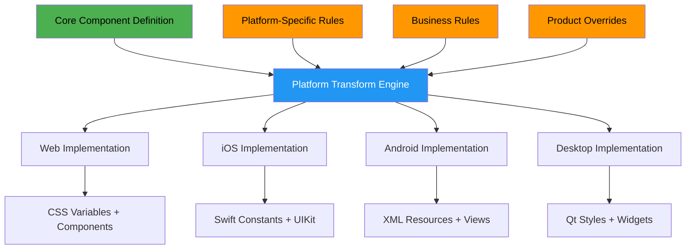
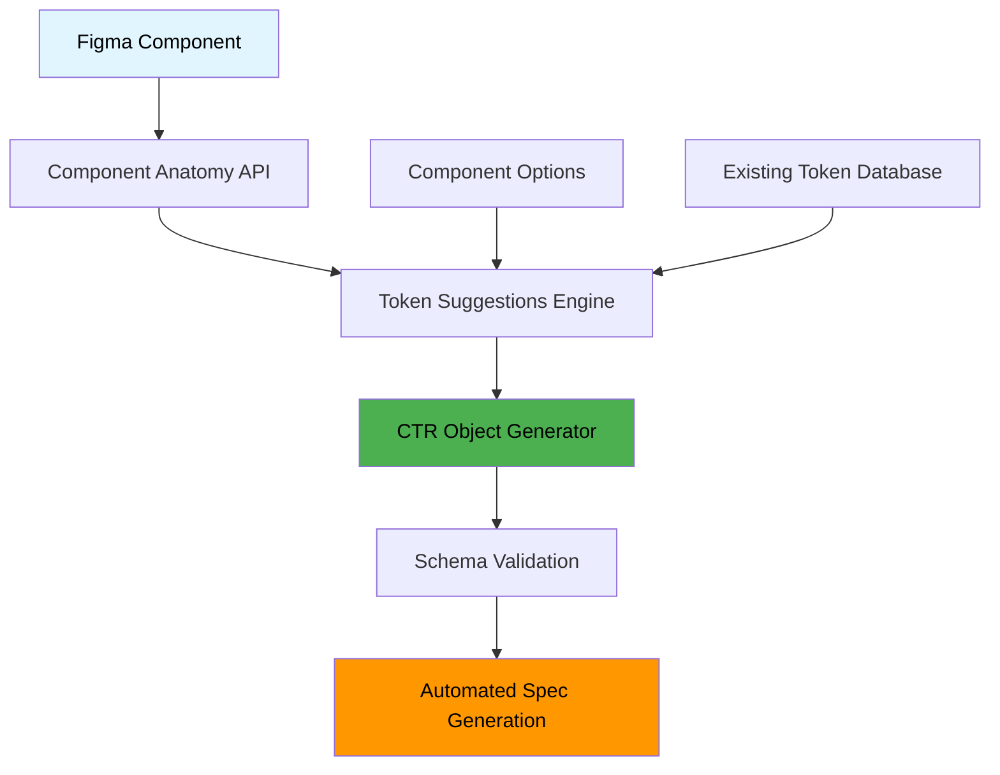

# Engineering Strategy
## for Model Changes

Technical Implementation of Multi-Platform Design Data

<div class="pt-12">
  <span @click="$slidev.nav.next" class="px-2 py-1 rounded cursor-pointer" hover="bg-white bg-opacity-10">
    Day 2 Discussion • Garth Braithwaite
  </span>
</div>

<!--
This session focuses on the technical implementation strategy for our multi-platform design data system changes.
-->

---
layout: default
---

# Engineering Strategy Overview

<div class="grid grid-cols-2 gap-8 mt-8">

<div>

## Technical Components
<v-clicks>

- **Design Data** structure and schemas
- **Component Options API** for states and variants
- **Component Anatomy** definitions
- **Design Tokens** hierarchy (Global → Base → Alias)
- **Component Token Relationships** (CTR)
- **Mappings & Parsers** for transformation

</v-clicks>

</div>

<div>

## Multi-Platform Customization
<v-clicks>

- **Platform-specific implementation** formats
- **Business-specific flavoring** (future)
- **Product specialization** layers
- **Parser transforms** for data conversion
- **Filtered data** for platform needs
- **Value overrides** and mappings

</v-clicks>

</div>

</div>

<!--
From the Slack Canvas planning, these are the technical components we need to address in our engineering strategy.
-->

---
layout: default
---

# From Anonymous Tokens to CTR Objects

<div class="grid grid-cols-2 gap-6 mt-4">

<div>

## Current: String-Based Problem
<v-clicks>

```yaml
# Hard to validate, prone to errors
slider-handle-border-width-down-small: "7px"
button-minimum-height-medium: "40px"
```

**Issues:**
- No schema validation
- Naming inconsistency  
- Manual spec maintenance
- Implementation guesswork

</v-clicks>

</div>

<div>

## CTR Solution: Structured Objects
<v-clicks>

```yaml
id: 683fb538-290c-423f-990b-d7134e485f51
$schema: adobe/spectrum/schema/0.0.0/token-types/dimension.yml
component: slider
part: handle
property: border-width
value: 7px
options:
  state: down
  size: small
  platform: mobile
```

**Benefits:**
- Schema validation
- Automatic generation
- Multi-platform support
- Clear relationships

</v-clicks>

</div>

</div>

<div class="mt-4" v-click>

> **Key Insight**: Component Options + Component Anatomy = Structured Data Possible

</div>

<!--
This is the technical foundation for how we think about component-token relationships. It's more sophisticated than simple name-based mappings.
-->

---
layout: default
---

# Data Architecture: From Scattered to Structured

<div class="grid grid-cols-2 gap-8 mt-8">

<div>

## Current: Scattered Data
<v-clicks>

- **Design Data**: Multiple repos, formats
- **Component Specs**: Manual authoring
- **Figma Assets**: Disconnected from code
- **Documentation**: Multiple sources
- **Partnership Info**: Slack, meetings, heads

</v-clicks>

</div>

<div>

## Proposed: Unified Schema
<v-clicks>

```yaml
# Unified Component Definition
component:
  name: "button"
  anatomy: ComponentAnatomy
  options: OptionsAPI
  tokens: ComponentTokenRelations
  platforms: PlatformMappings
  documentation: DocumentationRefs
  partnership: CollaborationData
```

</v-clicks>

</div>

</div>

<div class="mt-8" v-click>

> **Key Insight**: Structured data enables automation, validation, and multi-platform generation

</div>

<!--
Moving from scattered information to structured schemas enables the automation and consistency we need for multi-platform success.
-->

---
layout: default
---

# Multi-Platform Customization Strategy



<!--
This diagram shows how a single core definition can be transformed into platform-specific implementations through configurable rules and overrides.
-->

---
layout: default
---

# Component Options API

<div class="grid grid-cols-2 gap-8 mt-8">

<div>

## Current Challenges
<v-clicks>

- **State variations** manually maintained
- **Different platforms** implement states differently
- **Inconsistent naming** across implementations
- **Missing states** on some platforms
- **Complex spec files** hard to maintain

</v-clicks>

</div>

<div>

## Proposed API Structure
<v-clicks>

```typescript
interface ComponentOptions {
  states: {
    default: StateDefinition
    hover: StateDefinition
    active: StateDefinition
    focus: StateDefinition
    disabled: StateDefinition
  }
  variants: {
    primary: VariantDefinition
    secondary: VariantDefinition
    tertiary: VariantDefinition
  }
  dimensions: DimensionDefinitions
}
```

</v-clicks>

</div>

</div>

<!--
The Component Options API provides a structured way to define all the variations and states that components can have across platforms.
-->

---
layout: default
---

# Technical Architecture: Designer Workflow Integration

<div class="grid grid-cols-2 gap-8 mt-8">

<div>

## Figma Integration Architecture
<v-clicks>



</v-clicks>

</div>

<div>

## Designer Experience Flow
<v-clicks>

1. **Designer selects component** in Figma
2. **System queries Component Anatomy** for valid parts
3. **Suggests existing tokens** from CTR database
4. **Guides naming** if new token needed
5. **Validates against schema** in real-time
6. **Generates CTR object** automatically
7. **Updates specs** across all platforms
8. **Creates changelog entry** automatically

**Result**: No manual spec maintenance

</v-clicks>

</div>

</div>

<div class="mt-8" v-click>

> **Technical enabler**: Schema-driven UI generation makes complex workflows simple

</div>

<!--
This shows how the technical architecture directly enables the improved designer experience.
-->

---
layout: default
---

# Addressing Real Designer & Engineering Pain Points

<div class="grid grid-cols-2 gap-6 mt-4 text-sm">

<div>

## Current S2 Spec Authoring Issues
<v-clicks>

- **Manual "Token definition" artboards** in each component page
- **No changelog tracking** for spec updates
- **Token naming confusion** - hard to know how to name new tokens
- **Difficult to find existing tokens** to reuse
- **Complex semantic alias decisions** without guidance
- **Third-party Tokens Studio dependency** creates risk
- **Manual sync meetings** required for implementation

</v-clicks>

</div>

<div>

## Technical Solutions via CTR Objects
<v-clicks>

- **Automated spec generation** from structured CTR data
- **Built-in change tracking** via schema versioning
- **Guided token authoring** with component anatomy
- **Automatic token discovery** and reuse suggestions
- **Schema-driven semantic aliases** with validation
- **Native authoring tools** reduce external dependencies
- **API-driven sync** eliminates manual handoffs

</v-clicks>

</div>

</div>

<div class="mt-4" v-click>

> **Goal**: Solve Allison's team workflow while improving engineering reliability

</div>

<!--
These are the specific pain points we heard in the Slack Canvas discussion. Our new model should directly address each of these issues.
-->

---
layout: default
---

# Parser & Transform Strategy

<div class="grid grid-cols-3 gap-6 mt-8">

<div v-click="1">

## Input Parsers
- **Figma API** data extraction
- **Design token** file parsing
- **Component spec** analysis
- **Documentation** scraping
- **Schema validation**

</div>

<div v-click="2">

## Transform Engine
- **Platform mapping** rules
- **Value conversion** (px → pt → dp)
- **Naming convention** transformation
- **State generation** from base values
- **Validation & linting**

</div>

<div v-click="3">

## Output Generators
- **CSS custom properties**
- **iOS Swift constants**
- **Android XML resources**
- **Desktop platform formats**
- **Documentation** generation

</div>

</div>

<div class="mt-8" v-click="4">

> **Architecture**: Pluggable parsers and generators enable platform extension

</div>

<!--
This shows the technical architecture for how we transform design data from various inputs into platform-specific outputs.
-->

---
layout: default
---

# Implementation Phases

<div class="grid grid-cols-3 gap-6 mt-8">

<div v-click="1">

## Phase 1: Core Infrastructure
- **Unified schema** definition
- **Transform engine** foundation
- **Basic parsers** (Figma, tokens)
- **One platform** implementation (Web)
- **Governance tooling**

</div>

<div v-click="2">

## Phase 2: Platform Expansion
- **iOS implementation** 
- **Android implementation**
- **Desktop platform** support
- **Advanced transforms**
- **Cross-platform validation**

</div>

<div v-click="3">

## Phase 3: Advanced Features
- **AI-assisted authoring**
- **Automated state generation**
- **Performance optimization**
- **Visual diff tooling**
- **Advanced governance**

</div>

</div>

<!--
This phased approach ensures we build solid foundations before expanding to complex features.
-->

---
layout: default
---

# Technical Discussion Topics

<div class="grid grid-cols-2 gap-8 mt-8">

<div>

## Architecture Decisions
<v-clicks>

- **Schema format**: JSON Schema, TypeScript, or custom?
- **Transform engine**: Build vs. adapt existing tools?
- **Storage**: Git-based vs. database vs. hybrid?
- **API design**: REST vs. GraphQL vs. custom protocol?
- **Validation**: Compile-time vs. runtime vs. both?

</v-clicks>

</div>

<div>

## Platform Integration
<v-clicks>

- **Web**: How to integrate with existing Spectrum CSS?
- **iOS**: Swift package vs. Xcode integration?
- **Android**: Gradle plugin vs. build integration?
- **Desktop**: Qt resource system integration?
- **Tooling**: IDE plugins and developer experience?

</v-clicks>

</div>

</div>

<!--
These are the technical decisions we need to make as we move forward with implementation.
-->

---
layout: default
---

# Risk Mitigation

<div class="grid grid-cols-2 gap-8 mt-8">

<div>

## Technical Risks
<v-clicks>

- **Complex migration** from current system
- **Performance impact** of transform engine
- **Platform compatibility** issues
- **Tool integration** challenges
- **Scale limitations** as system grows

</v-clicks>

</div>

<div>

## Mitigation Strategies
<v-clicks>

- **Gradual migration** with parallel systems
- **Performance benchmarking** and optimization
- **Platform pilot programs** before full rollout
- **Extensive testing** and validation
- **Scalable architecture** from day one

</v-clicks>

</div>

</div>

<!--
We need to be thoughtful about the risks and have concrete plans to address them.
-->

---
layout: default
---

# Success Metrics for Engineering

<div class="grid grid-cols-2 gap-8 mt-8">

<div>

## Development Velocity
<v-clicks>

- **Faster component implementation** across platforms
- **Reduced bugs** from inconsistent token usage
- **Automated validation** catches errors early
- **Easier platform onboarding** for new implementations

</v-clicks>

</div>

<div>

## System Reliability
<v-clicks>

- **Consistent behavior** across all platforms
- **Automated testing** of design-code alignment
- **Version control** for all design decisions
- **Clear rollback** strategies for changes

</v-clicks>

</div>

</div>

<div class="mt-8" v-click>

> **Ultimate goal**: Engineering teams focus on user experience, not token management

</div>

<!--
These metrics help us measure whether our engineering strategy is actually improving the developer experience.
-->

---
layout: center
class: text-center
---

# Discussion Time

## Let's dive into the technical details

<div class="text-4xl text-blue-400 mt-8">
  🔧
</div>

<div class="mt-8">
Ready to tackle the engineering challenges...
</div>

<!--
Now let's get into the technical discussion and hear from the engineering teams about implementation approaches.
-->
