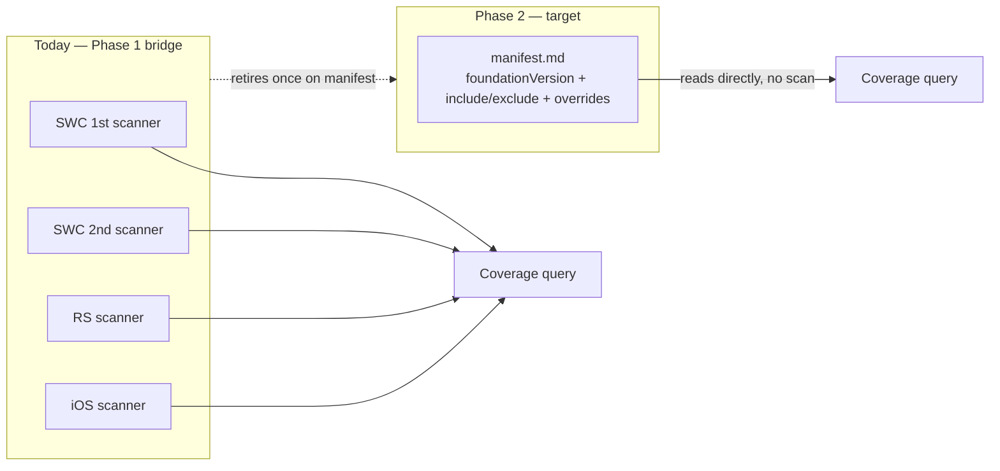

# Design Data
## July 31, 2026 · Director Review

Adoption, not shipping — an honest accounting, one decision, three asks.

  
    Let's dive in <carbon:arrow-right class="inline"/>
  

<!--
Cold open. Don't over-explain the tagline — it's the whole talk in one line.
-->

---
layout: center
class: text-center
---

# Since May: the bar Sean set

> "Whatever we do for KRs, the success should be grounded in proof that this stuff is being used by your teams... It can't just be that we built a thing. It has to be adoption of some kind."

His priority order:

<ol class="mt-2">
<li v-click>1. Can all implementations use the tool</li>
<li v-click>2. Are we set up for adaptive</li>
<li v-click>3. AI usage</li>
</ol>

<!--
That reorders the story from how it was pitched in May — this whole deck follows that order.
-->

---
layout: default
---

# Where we said we'd be — honest scorecard

At the close of May 15, the commitment was six weeks out: metrics, the first platform on the
cascade, and a Mercury/Protopack integration milestone.

<strong>Metrics: partial.</strong> A first deterministic coverage baseline exists; the productized, scheduled tool is still targeted for Sep 30.

<strong>First platform on the cascade: not yet.</strong> The adoption gap — the most important thing to be straight about.

<strong>Mercury / Protopack milestone: no confirmed hit.</strong> Conversations remain active but unlanded.

Two out of three commitments are behind. "We built it" isn't the win condition.

---
layout: default
---

# What we shipped — Spec & Authoring Engine

- **`@adobe/spectrum-design-data` 1.0.3** (spec **3.1.0**) — full lifecycle ops (create, edit,
  deprecate, rename, alias-rewire, remove) for tokens *and* non-token data, from CLI, TUI, and MCP alike
- Round-trip conformance gates keep the JS layer and Rust core from silently drifting
- Phase A of the spec ratified (authoring-workflow, all-data contract, generator conformance)
- Guideline entity is now first-class in the spec (schema + validator + generator)

<!--
This is the "we built it" half — necessary, not sufficient. The next slides keep that honest.
-->

---
layout: default
---

# What we shipped — Taxonomy, Distribution, Adaptivity

**Taxonomy & data quality**
- All **843 residual tokens** decomposed into structured fields (size, density, color props, variant/anatomy, gap endpoints)
- Includes the hard tail: **277** vocabulary-gap/spatial-qualifier + **209** unclassified tokens — resolved, not left open

**Distribution**
- Swift bindings ship — native macOS apps consume design data directly
- `@adobe/design-data-wasm` opens a path to thin wrappers instead of per-platform reimplementation

**Adaptivity**
- The cascade model is live in the spec and SDK: platforms declare what they inherit vs. override — auditable and reversible, not fork-and-drift

---
layout: default
---

# What we shipped — Figma Variables POC, measured

Captured a real S2–Web snapshot: **2,951 variables / 6 non-remote collections**.

Covered (2 of 6)

96.2% · 752/782

93.3% · 807/865

- **1,304 variables** across the other 4 collections (Typography, Layout, S2.Color-theme, Iconography) have **no coverage yet**
- `.Platform scale` alone has **824 generator-only names** that don't exist in Figma — a naming-convention gap, not just a coverage gap
- The generator now *consumes* a name-mapping override artifact — closing this gap is filling in real names, not writing new code

---
layout: center
class: text-center
---

# The headline risk

No platform has adopted the cascade yet.

Everything from here is about closing that gap.

---
layout: default
---

# Metrics baseline

A first deterministic coverage baseline — transitive alias closure, not just direct call-sites,
against the 2,150 live-token denominator.

SWC 1st-gen

42.5%

SWC 2nd-gen

25.6%

React Spectrum

27.1%

<strong>iOS</strong>

4.1%

Aaron's bar: *"we're making the report by running a deterministic, versioned and released
tool... 'make me a report' doesn't make me confident, that's a little bit of smoke and mirrors."*
This baseline meets it — script-generated, re-run twice, byte-identical.

---
layout: default
---

# The path to these numbers (1/3)

Four hand-tuned scanners, one per platform — each reading a **different shape**, because
there's no common data source to read coverage from yet:

<strong>SWC 1st-gen</strong> <code>var(--spectrum-x)</code> resolution

<strong>SWC 2nd-gen</strong> <code>token()</code> compiled-output scan (postcss)

<strong>React Spectrum</strong> <code>colorScale()</code> regex-expanded

<strong>iOS</strong> asset-catalog scan

Run manually, against a single checkout. No AI in the number — byte-identical on re-run.

---
layout: default
---

# Why it stays a snapshot (2/3)

- Not scheduled, not in CI, not resilient to a platform changing its own tooling
- If SWC 2nd-gen changes how it compiles `token()` calls, our detector breaks quietly — the number goes stale without anyone noticing

"Not that we lack a report, but that we lack a shared way for a platform to say what it depends
on. Everything downstream — coverage numbers included — is a workaround for that missing declaration."

— RFC #1324

---
layout: default
---

# The durable fix: manifest-derived metrics (3/3)

Once every platform declares its relationship to the foundation in the **same manifest shape**,
coverage stops being something we infer from compiled output and becomes something we read
directly. The same manifest also powers the starter repos (adoption on-ramp) — **adopting gets
a platform metrics for free.**

RFC #1324 — Sep 30 Phase 1 tool · Nov 20 manifests where landed

---
layout: default
---

# The cascade KR decision — needs a call today

> "Is that still a possible timeline, or are we... declaring success on it for web...
> partially we want to do it on iOS and Android?" — Josh, May 15

This spans two KRs:

- **KR 3D.1** — per-platform adaptive-data architecture, due **Aug 28** — unlikely to land for iOS/Android in its current form
- **KR 1B.5** — connect Web, iOS, Android to foundational S2 data, due **Nov 20** — no platform is on the cascade yet

<strong>(a)</strong> Partial success — web ships, iOS/Android move to later KRs

<strong>(b)</strong> Move the deadline(s)

<strong>(c)</strong> Split into separate web vs. iOS/Android KRs

<!--
This is the concrete instance of "adoption, not shipping" — letting it drift a second review is the mistake.
-->

---
layout: default
---

# Adaptivity — answering Allison's question

> "How much change do we reasonably expect at each level of the cascade?" — Allison, May 15

The commitment: one real token, full resolution chain —
**foundation → S2 platform → web/iOS/Android → application override.**

<strong>Status: in progress, not yet complete.</strong> 
Lines up with KR 3D.1's own "one worked example" gate. Ready to walk through live at or before
this review — if it slips, we'll say so.

---
layout: default
---

# The adoption on-ramp

### 1. Figma Variables authoring POC
Invert today's pipeline: design data becomes canonical and *authors* Figma Variables directly.
Figma becomes a synchronized surface, not the origin.

> "If the logic and rationale of design decisions is obfuscated behind a technical layer
> that's inaccessible to designers, they'll start making decisions that contradict it." — Nate

> "The value in an authoring tool is the consistency it builds — it enforces that consistency over time." — Josh

### 2. Starter repos — fork **iOS first**
Manifest-based repo pins a foundation version, filters to what a platform needs, generates its
Figma Variables. iOS: Swift bindings already ship, lowest coverage (4.1%) so the before/after is
most visible, and named directly in KR 1B.5.

---
layout: default
---

# Roadmap

**Shipped**
- Authoring engine 1.0.3 / spec 3.1.0, full lifecycle CLI/TUI/MCP
- Cascade model live in spec + SDK
- Token decomposition complete (843 tokens)
- Figma POC baseline + audit + override-aware generator

**By Aug 28**
- Cascade worked example — KR 3D.1
- 3 data-system metrics implemented
- Cascade KR decision executed

**By Sep 30 (interim)**
- RFC #1324 Phase 1 tool: productized, CI-wired coverage
- Figma Variables authoring POC demoable

**By Nov 20**
- First platform adopted onto the cascade via starter repo — KR 1B.5
- Baseline metrics analyzed with platform partners
- Design-data documentation published

---
layout: center
class: text-center
---

# What we need from this review

<strong>1. Decide the cascade KRs.</strong> KR 3D.1 (Aug 28) and KR 1B.5 (Nov 20) won't cover
iOS/Android as-is. Pick (a) partial success, (b) move the deadline(s), or (c) split the KRs —
the one call we can't defer a second review.

<strong>2. Help us land the first platform — we recommend iOS.</strong> Lowest integration
lift, lowest coverage (most visible before/after), named directly in KR 1B.5. What would help
get it committed before Nov 20 — exec air cover, a partner intro, a shared deliverable?

<strong>3. Are we a dependency for the OKRs above us?</strong> If design-data is on the
critical path for AI-UI or adaptive-data this half, help us make that link explicit — or tell
us we're not, so we don't plan around it.

FYI, not an ask: Figma Variables authoring POC targeted demoable by Sep 30.

<!--
Close here. Don't re-read the slide — let the asks stand and open the floor.
-->
