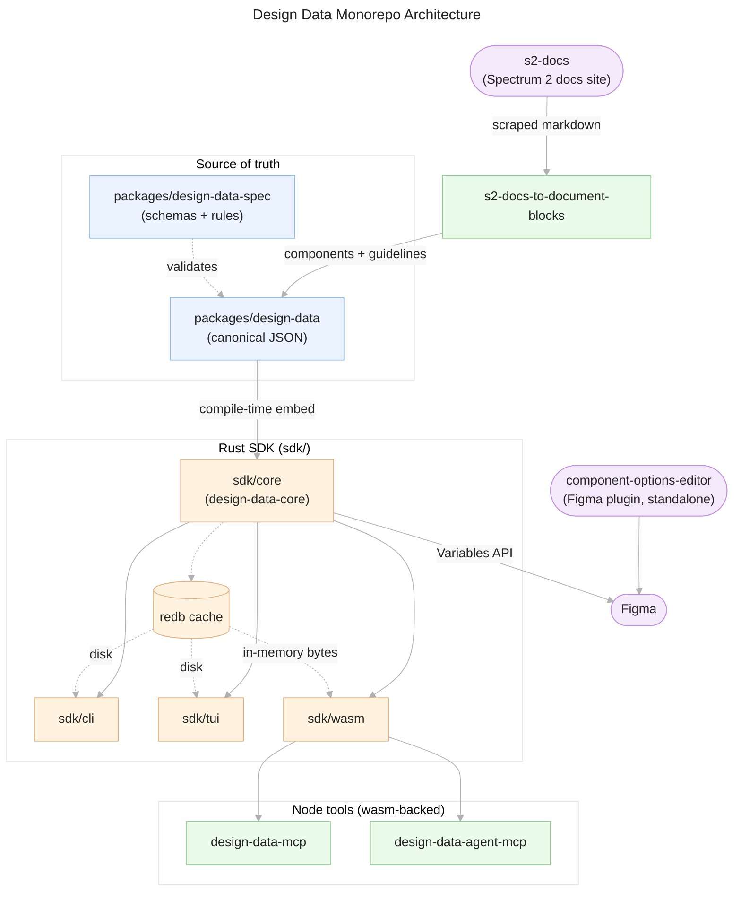
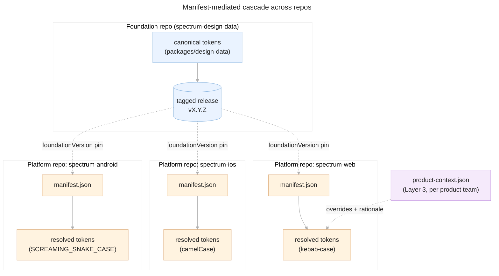

# Design Data
## From flat strings to structured design data

**Audience:** Engineers & designers familiar with `@adobe/spectrum-tokens`
**Goal:** Understand what `packages/design-data-spec` solves, and what it unlocks

<div class="pt-12">
  <span @click="$slidev.nav.next" class="px-2 py-1 rounded cursor-pointer" hover="bg-white bg-opacity-10">
    Let's dive in <carbon:arrow-right class="inline"/>
  </span>
</div>

---
layout: default
---

# Agenda

1. **The legacy world** — hyphen-delimited names carry hidden metadata
2. **The fix** — the name object
3. **The registry** — keeping vocabulary consistent
4. **Anatomy overlap** — component parts vs. token names
5. **The monorepo** — how it's all wired together
6. **Speed** — the SDK's embedded database
7. **Platform autonomy** — `manifest.md`
8. **Tools** — Figma variables, AI, CLI, TUI
9. **What's next** — roadmap & Q&A

---
layout: default
---

# The legacy world
## One string, several jobs

A real token from `packages/tokens/src/layout-component.json`:

```json {all|2|3|4-5}
"tab-item-bottom-to-text-small": {
  "component": "tabs",
  "deprecated": true,
  "deprecated_comment": "Use semantic token list-item-padding-vertical-spacious
    instead. Requires refactor: this token + base-padding-vertical will get
    desired value"
}
```

One flat string, `tab-item-bottom-to-text-small`, is quietly encoding:
- **component**: `tab-item`
- **a from/to spacing relationship**: `bottom-to-text`
- **a size**: `small`

<!--
- Legacy debt isn't hypothetical — it's tracked explicitly in `packages/tokens/naming-exceptions.json`.
- Canonical spec-doc example to have in your back pocket: `accent-background-color-hover` bundles
  component, object, property, and state into one opaque token.
- The brittleness: renaming, reordering, or adding a concept means restructuring the whole string.
  Nothing enforces which words are valid where. Tooling can only pattern-match, never query.
- This specific token is a good example because it's already marked deprecated in favor of a
  semantic replacement — the team already knows this shape doesn't scale.
-->

---
layout: default
---

# The fix: the name object
## Same token, structured

<div class="grid grid-cols-2 gap-4">
<div>

**Before** (legacy, flat string)

```json
"tab-item-bottom-to-text-small"
```

One string, walked apart:

```jsonc {1|2|3|4|5}{at:1}
// space-between (implied by file, not literal)
"tab-item"
"bottom"
"text"
"small"
```

</div>
<div>

**After** (name object, structured)

```json {2|3|4|5|6}{at:1}
{
  "property": "space-between",
  "component": "tabs",
  "from": "bottom",
  "to": "text",
  "size": "small"
}
```

</div>
</div>

The legacy string is now an **output** of serialization — not the source of truth.

<!--
- Fields are declared and typed — semantic (component, state, variant, size, anatomy,
  object...) or mode-set (colorScheme, scale, contrast).
- Escape hatch: string names still validate but trigger a tracked warning (SPEC-017) — this is a
  migration path, not a wall. Nobody's naming is broken overnight.
- Ref: packages/design-data-spec/spec/token-format.md, taxonomy.md
-->

---
layout: default
---

# The real code doing the conversion
## `sdk/core/src/naming.rs`

```rust {all|1-7|9-19}
pub struct NameObject {
    pub property: String,
    pub component: Option<String>,
    pub variant: Option<String>,
    pub state: Option<String>,
}

pub fn generate_legacy_name(obj: &NameObject) -> String {
    let mut parts: Vec<&str> = Vec::new();
    if let Some(v) = &obj.variant {
        parts.push(v);
    }
    if let Some(c) = &obj.component {
        parts.push(c);
    }
    parts.push(&obj.property);
    if let Some(s) = &obj.state {
        parts.push(s);
    }
    parts.join("-")
}
```

This is a real function in the SDK — the legacy string is generated *from* the structured object, on demand.

<!--
- parse_legacy_name (same file) does the reverse: decomposes an existing flat key back into a
  NameObject, which is how the migration of ~2,400 existing tokens works without hand-editing
  every one.
- Good spot to pause: this is the actual mechanism, not a hypothetical — worth pulling up the
  file live if there's time.
-->

---
layout: default
---

# Keeping vocabulary consistent: the registry

A **registry** is a JSON file under `packages/design-data/registry/` — the single allowed
vocabulary for one name-object field.

| Field | Registry file | Validated by |
|---|---|---|
| `name.anatomy` | `anatomy-terms.json` | SPEC-020, 023, 024, 025, 035 |
| `name.object` | `token-objects.json` | SPEC-009 |
| `name.state` | `states.json` | — |
| `name.size` | `sizes.json` | — |
| `name.variant` | `variants.json` | — |

Validators flag values not present in the registry — this is what stops five different
spellings of "hover" from creeping in.

<!--
- The field catalog (schemas/field.schema.json) is what makes the whole name-object schema
  configurable rather than hardcoded — new fields can be declared without a schema rewrite.
- Enforcement rules live in packages/design-data-spec/rules/rules.yaml.
- Ref: packages/design-data-spec/spec/registry.md
-->

---
layout: default
---

# Where anatomy overlaps with token names

Two **distinct registries** compose in a single token:

- `anatomy-terms.json` — visible named parts (`handle`, `icon`, `track`)
- `token-objects.json` — abstract styling surfaces (`background`, `border`, `edge`)

```json
{
  "component": "slider",
  "anatomy": "handle",
  "object": "background",
  "property": "color"
}
```

A slider handle's background color token references anatomy `handle` **and** object
`background` — same token, two vocabularies doing different jobs.

<!--
- Anatomy term tiers: primitive (icon, label — reused everywhere) -> composite (checkbox,
  avatar — another component used as a part) -> component-specific (loupe, gripper).
- Cross-registry ID overlap is fine by design (SPEC-033) — "actions" can be both an anatomy term
  and a component category without conflict.
- Ref: packages/design-data-spec/spec/anatomy-format.md, taxonomy.md#component-anatomy-vs-token-objects
-->

---
layout: default
---

# How it's all wired together

<div class="diagram-viewport">
<div v-click class="hidden"></div>
<div v-click class="hidden"></div>
<div class="diagram-inner" :style="{ transform: $clicks >= 2 ? 'translateY(0) scale(0.4)' : ($clicks === 1 ? 'translateY(calc(-80% + 440px)) scale(0.8)' : 'translateY(0) scale(0.8)') }">



</div>
<div class="diagram-hint" v-if="$clicks === 0">click for more &#8595;</div>
<div class="diagram-hint" v-if="$clicks === 1">click to fit whole diagram</div>
</div>

<!--
- packages/design-data is the canonical structured JSON; packages/design-data-spec defines
  the schemas/rules that validate it — separate concerns, separate packages.
- sdk/core embeds a snapshot of that JSON at compile time (per sdk/CLAUDE.md: changes to
  packages/design-data/tokens/*.tokens.json etc. invalidate the build).
- sdk/cli, sdk/tui, and sdk/wasm all depend on sdk/core via path = "../core" in their
  Cargo.toml — one engine, three surfaces (native CLI, native TUI, wasm for Node).
- tools/design-data-mcp and tools/design-data-agent-mcp both declare
  "@adobe/design-data-wasm": "workspace:*" in package.json — confirmed dependency, not assumed.
- tools/component-options-editor is a separate Figma plugin (TS) for authoring component
  option schemas visually, independent of the wasm bridge — that's why it's drawn outside
  the "Node tools" box instead of alongside the wasm-backed MCP servers.
- the redb cache holds a ~2MB JSON dataset and gets it to sub-second load; cli/tui hit it
  as a file on disk, wasm embeds it as in-memory bytes (no filesystem in the browser/Node runtime).
- sdk/core talks to Figma over its Rust FigmaClient, which wraps Figma's REST Variables API.
- tools/s2-docs-to-document-blocks reads scraped Spectrum 2 docs-site markdown (staged in
  docs/s2-docs/components) and writes structured documentBlocks + guidelines directly into
  packages/design-data — one-way ingestion into the canonical JSON, run on demand rather than
  gated in CI.
-->

---
layout: default
---

# Why this needs to be fast
## The SDK's embedded database

> "The JSON files on disk remain the single source of truth. This module builds a compact,
> indexed [redb](https://www.redb.org) database from them and caches it so the CLI/TUI can skip
> re-parsing ~2 MB of JSON on every invocation. The cache is **never authoritative**: it is
> content-addressed, rebuilt whenever the JSON changes, and any cache error falls back to
> loading from JSON."
>
> — doc comment, `sdk/core/src/cache/mod.rs`

**Payoff:** the TUI loads the full ~2,400-token Spectrum corpus in under a second.

<!--
- JSON stays the source of truth; the redb cache is a derived performance layer, not a second
  source of truth — important distinction if anyone asks "which one wins on conflict."
- Cache layout is keyed by dataset path + catalog config, so distinct datasets don't thrash a
  shared cache file (see sdk/core/src/cache/mod.rs module doc for the exact key scheme).
-->

---
layout: default
---

# Platform autonomy: `spec/manifest.md`

A platform manifest pins a `foundationVersion` and layers on top of it:

| Field | Purpose |
|---|---|
| `include` / `exclude` | Query-based subsetting of the foundation token set |
| `overrides` | Typed value overrides (type-safe — can't change a token's kind) |
| `extensions` | New tokens / mode sets at the platform layer |
| `modeSetRestrictions` | Mode set restrictions for this platform |

`extensions.formatting` lets a platform choose its **own serialization** — concept order,
casing, delimiter, abbreviations — so iOS/Android/Web can each emit their native naming
convention from the *same* underlying name objects.

<!--
- This is the mechanism that turns "one central token package" into "platforms own their local
  view, foundation owns the shared vocabulary."
- Ref: packages/design-data-spec/spec/manifest.md
- Good moment to pause for questions — this is the pivot from "here's the data model" to
  "here's why it matters to your platform."
-->

---
layout: default
---

# One foundation, many repos

<div class="diagram-viewport">
<div v-click class="hidden"></div>
<div class="diagram-inner" :style="{ transform: $clicks >= 1 ? 'translateY(calc(-100% + 440px))' : 'translateY(0)' }">



</div>
<div class="diagram-hint" v-if="$clicks === 0">click for more &#8595;</div>
</div>

<!--
- The foundation repo publishes tagged releases; each platform repo's manifest.json pins a
  foundationVersion — that's the only coupling between repos, no shared build step required.
- include/exclude/overrides/extensions in each manifest resolve against that pinned version
  to produce a platform-specific resolved token set — same source tokens, different subset
  and typed overrides per platform.
- extensions.formatting (see previous slide) is why the resolved output differs in casing/
  naming per platform even though the underlying name objects are identical.
- product-context.json is optional and per product team, not per platform — drawn here
  attached to one platform repo to show it layers on top of the already-resolved platform
  set (Layer 3 on top of Layer 2), per cascade.md's layer model.
- This is the "different repos" answer to platform autonomy: foundation doesn't need to know
  how many platforms exist or what they do with the tokens, only that they pin a version.
-->

---
layout: default
---

# Tools this unlocks

**Figma variables**
- `sdk/core/src/figma/api.rs` — `FigmaClient`, a Rust client for Figma's Variables REST API
- `tools/component-options-editor` — Figma plugin for authoring component option schemas visually

**AI tooling**
- `tools/design-data-mcp` (current, wasm in-process MCP server)
- `tools/design-data-agent-mcp` (agent-facing authoring sessions)
- `tools/design-data-skill`, `tools/s2-docs-mcp`

**CLI & TUI**
- `sdk/cli` (`design-data-cli`) — direct queries/validation against the dataset
- `sdk/tui` (RFC #973) — interactive 4-screen guided wizard, nudges token reuse over duplication

<!--
- Concrete "manage your own Figma variables" story: structured data in, structured data out, no
  more hand-editing Figma variable panels out of sync with code.
- tools/design-data-mcp supersedes the deprecated tools/spectrum-design-data-mcp — worth
  naming explicitly if anyone still has the old one bookmarked.
- TUI umbrella tracked in docs/rfc-coordination.md under discussion #714.
-->

---
layout: default
---

# What's next

- **Authoring UI** — a natural next step: same spec/registry validation, but a GUI instead of
  CLI/TUI, for designers who don't want a terminal (directional — not yet committed to an RFC)
- Platform teams: what override/extension autonomy do *you* need first?

## The throughline

Legacy: one opaque string per token, validated by nothing but convention.

Now: structured name objects + registries (source of truth) → embedded DB (speed) →
manifest (platform autonomy) → CLI/TUI/MCP/Figma tooling (how everyone actually touches it).

<div class="pt-12 text-center">

# Questions?

</div>
