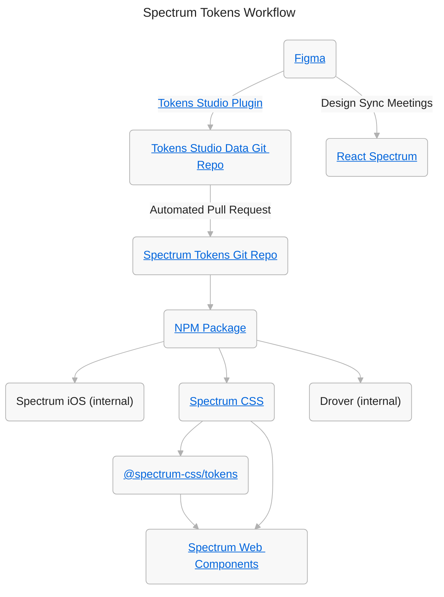
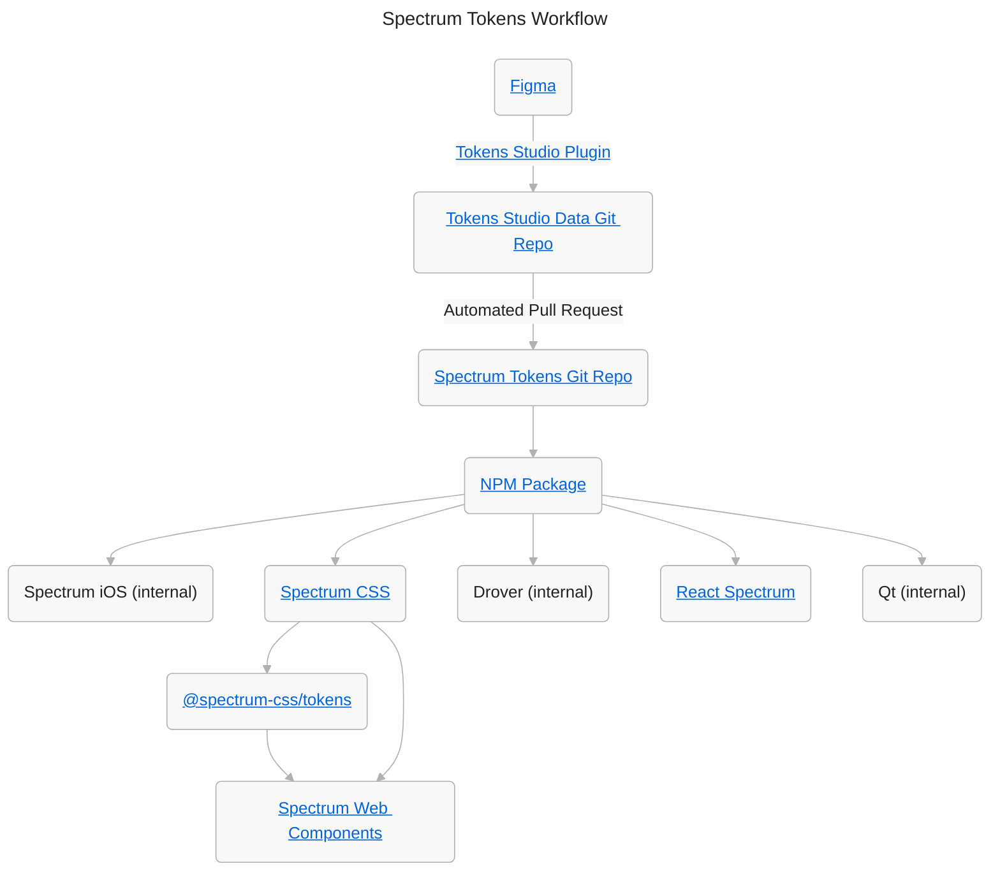

A diagram showing how design tokens are created and distributed for [Spectrum](https://spectrum.adobe.com), Adobe's design system.

```mermaid
---
title: Spectrum Tokens Workflow
config:
  theme: base
  themeVariables:
    primaryColor: "#F8F8F8"
    primaryTextColor: "#222222"
    primaryBorderColor: "#B1B1B1"
    lineColor: "#B1B1B1"
---

flowchart TD
    figma("<a style='color: #35;0265DC;' href='https://figma.com'>Figma</a>")
    tokenStudio("<a style='color: #35;0265DC;' href='https://github.com/adobe/spectrum-tokens-studio-data'>Tokens Studio Data Git Repo</a>")
    spectrumTokens("<a style='color: #35;0265DC;' href='https://github.com/adobe/spectrum-tokens'>Spectrum Tokens Git Repo</a>")
    spectrumTokensNPM(<a style='color: #35;0265DC;' href='https://www.npmjs.com/package/@adobe/spectrum-tokens'>NPM Package</a>)
    spectrumIOS("Spectrum iOS (internal)")
    spectrumCSS(<a style='color: #35;0265DC;' href='https://github.com/adobe/spectrum-css'>Spectrum CSS</a>)
    drover("Drover (internal)")
    reactSpectrum(<a style='color: #35;0265DC;' href='https://react-spectrum.adobe.com/react-spectrum/'>React Spectrum</a>)
    spectrumWebComponents(<a style='color: #35;0265DC;' href='https://opensource.adobe.com/spectrum-web-components/'>Spectrum Web Components)
    spectrumCSSTokens(<a style='color: #35;0265DC;' href='https://www.npmjs.com/package/@spectrum-css/tokens'>@spectrum-css/tokens</a>)

    figma -->|"<a style='color: #35;0265DC;' href='https://tokens.studio/'>Tokens Studio Plugin</a>"| tokenStudio
    tokenStudio -->|Automated Pull Request| spectrumTokens
    spectrumTokens --> spectrumTokensNPM
    spectrumTokensNPM --> spectrumIOS
    spectrumTokensNPM --> spectrumCSS
    spectrumCSS --> spectrumCSSTokens
    spectrumCSSTokens --> spectrumWebComponents
    spectrumCSS --> spectrumWebComponents
    spectrumTokensNPM -->drover
    figma -->|Design Sync Meetings|reactSpectrum

linkStyle default stroke-width:1px
```

The work with Spectrum 2 is slightly different.

```mermaid
---
title: Spectrum Tokens Workflow
config:
  theme: base
  themeVariables:
    primaryColor: "#F8F8F8"
    primaryTextColor: "#222222"
    primaryBorderColor: "#B1B1B1"
    lineColor: "#B1B1B1"
---

flowchart TD
    figma("<a style='color: #35;0265DC;' href='https://figma.com'>Figma</a>")
    tokenStudio("<a style='color: #35;0265DC;' href='https://github.com/adobe/spectrum-tokens-studio-data'>Tokens Studio Data Git Repo</a>")
    spectrumTokens("<a style='color: #35;0265DC;' href='https://github.com/adobe/spectrum-tokens'>Spectrum Tokens Git Repo</a>")
    spectrumTokensNPM(<a style='color: #35;0265DC;' href='https://www.npmjs.com/package/@adobe/spectrum-tokens'>NPM Package</a>)
    spectrumIOS("Spectrum iOS (internal)")
    spectrumCSS(<a style='color: #35;0265DC;' href='https://github.com/adobe/spectrum-css'>Spectrum CSS</a>)
    drover("Drover (internal)")
    reactSpectrum(<a style='color: #35;0265DC;' href='https://react-spectrum.adobe.com/react-spectrum/'>React Spectrum</a>)
    spectrumWebComponents(<a style='color: #35;0265DC;' href='https://opensource.adobe.com/spectrum-web-components/'>Spectrum Web Components)
    spectrumQt("Qt (internal)")
    spectrumCSSTokens(<a style='color: #35;0265DC;' href='https://www.npmjs.com/package/@spectrum-css/tokens'>@spectrum-css/tokens</a>)

    figma -->|"<a style='color: #35;0265DC;' href='https://tokens.studio/'>Tokens Studio Plugin</a>"| tokenStudio
    tokenStudio -->|Automated Pull Request| spectrumTokens
    spectrumTokens --> spectrumTokensNPM
    spectrumTokensNPM --> spectrumIOS
    spectrumTokensNPM --> spectrumCSS
    spectrumCSS --> spectrumCSSTokens
    spectrumCSSTokens --> spectrumWebComponents
    spectrumCSS --> spectrumWebComponents
    spectrumTokensNPM --> drover
    spectrumTokensNPM --> reactSpectrum
    spectrumTokensNPM --> spectrumQt

linkStyle default stroke-width:1px
```
