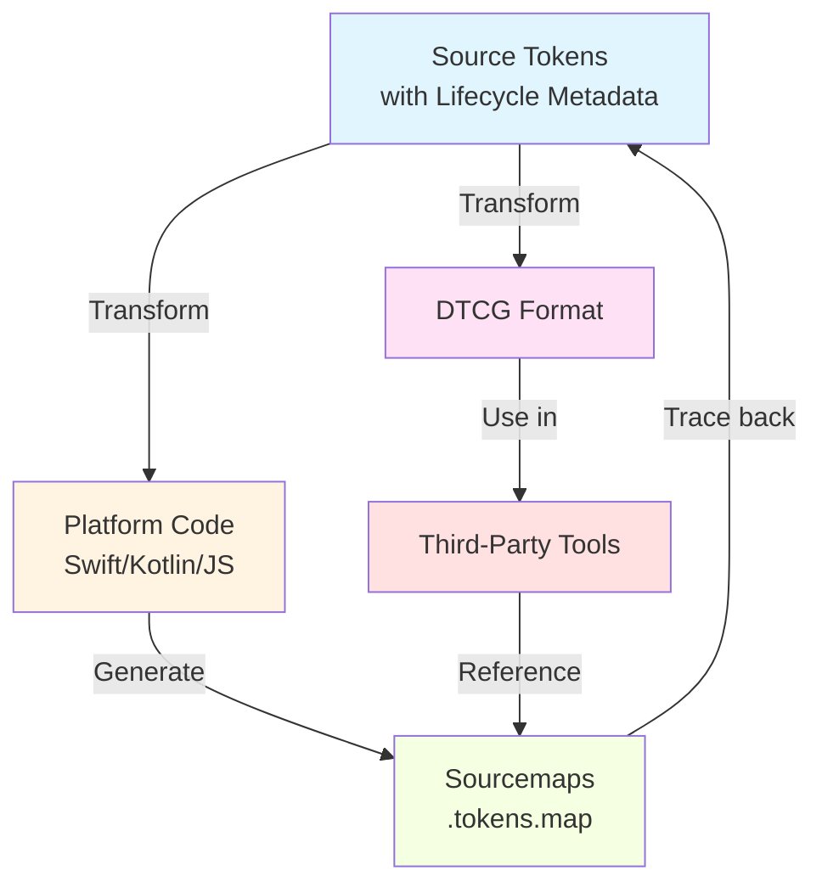

# Spectrum Design Data Governance
## November 7, 2025

**Duration:** 30 minutes  
**Presenter:** Garth Braithwaite

<div class="mt-12">

### Today's Agenda
1. Token Lifecycle Metadata (RFC #623)
2. Design Token Sourcemaps (RFC #626)
3. DTCG Format Output (RFC #627)

</div>

<div class="pt-12">
  <span @click="$slidev.nav.next" class="px-2 py-1 rounded cursor-pointer" hover="bg-white bg-opacity-10">
    Let's begin <carbon:arrow-right class="inline"/>
  </span>
</div>

---
layout: default
---

# Meeting Overview

## Three Complementary Initiatives

<div class="grid grid-cols-3 gap-4 mt-8">

<div class="p-4 border rounded">

### 1. Lifecycle Metadata
**Type:** Infrastructure  
**Status:** 🟡 RFC Draft  
**Time:** ~8 min

**What:** Metadata schema for token evolution and deprecation

**Seeking:** Feedback & comments

</div>

<div class="p-4 border rounded">

### 2. Token Sourcemaps
**Type:** Traceability  
**Status:** ✅ POC Complete  
**Time:** ~8 min

**What:** UUID-based traceability for generated code

**Seeking:** Feedback on POC approach

</div>

<div class="p-4 border rounded">

### 3. DTCG Format
**Type:** Interoperability  
**Status:** 🟡 RFC Draft  
**Time:** ~6 min

**What:** Industry-standard format output

**Seeking:** Feedback & direction

</div>

</div>

<div class="mt-8" v-click>

## How They Work Together

**Lifecycle Metadata** provides the infrastructure → **Sourcemaps** enable traceability → **DTCG Format** enables ecosystem integration

All three are **non-breaking, additive** enhancements to design data infrastructure.

</div>

---
layout: center
class: text-center
---

# Topic 1

## Token Lifecycle Metadata Framework

RFC #623: Infrastructure for Safe Token Evolution

<div class="pt-8">
  <span @click="$slidev.nav.next" class="px-2 py-1 rounded cursor-pointer" hover="bg-white bg-opacity-10">
    View details <carbon:arrow-right class="inline"/>
  </span>
</div>

---

# Lifecycle Metadata: Quick Overview

<div class="grid grid-cols-2 gap-6 mt-8">

<div>

## The Problem
- No formal lifecycle tracking
- Breaking changes without warning
- No migration guidance
- Blocks token refinement work

## The Solution
Add structured metadata to every token:
```json
{
  "lifecycle": {
    "introduced": "2.0.0",
    "status": "deprecated",
    "deprecated": "3.0.0",
    "plannedRemoval": "4.0.0",
    "renamed": "new-token-name",
    "message": "Migration guidance"
  }
}
```

</div>

<div>

## Key Benefits
✅ Safe token evolution  
✅ Guaranteed migration time  
✅ Automated tooling support  
✅ Clear deprecation process

## Governance Process
**Minimum 2 monthly meetings** between deprecation and removal

**Example:**
- Nov: Propose deprecation
- Dec: Review progress
- Jan: Approve removal
- Feb: Remove in next major

</div>

</div>

<div class="text-center mt-8" v-click>

**Status:** RFC ready for review → **Seeking:** Feedback on approach and next steps

[View full slides: `token-lifecycle-metadata.md`]

</div>

---
layout: center
class: text-center
---

# Topic 2

## Design Token Sourcemaps & Traceability

RFC #626: POC Complete ✅

<div class="pt-8">
  <span @click="$slidev.nav.next" class="px-2 py-1 rounded cursor-pointer" hover="bg-white bg-opacity-10">
    View details <carbon:arrow-right class="inline"/>
  </span>
</div>

---

# Token Sourcemaps: Quick Overview

<div class="grid grid-cols-2 gap-6 mt-8">

<div>

## The Problem
- Generated code has no link to source
- Can't trace Swift → Token → Figma
- Manual deprecation tracking
- No usage analytics

## The Solution
Generate `.tokens.map` files during compilation:
```json
{
  "version": 1,
  "sourceVersion": "13.0.0",
  "mappings": {
    "accentBackgroundColorDefault": {
      "uuid": "C84D8828-6216-...",
      "designName": "accent-background-color-default",
      "generatedFile": "SPColorToken.swift"
    }
  }
}
```

</div>

<div>

## POC Status: ✅ Complete
✅ UUID extraction  
✅ Version tracking  
✅ Sourcemap generation  
✅ Symbol mapping  
✅ Zero linting errors

## What This Enables
🔮 Deprecation warnings in Xcode  
🔮 Figma sync validation  
🔮 Usage analytics  
🔮 Automated migration guides

## Implementation
- **Where:** `spectrum-tokens-ios/Tools/tokentool`
- **Docs:** `POC_COMPLETION_SUMMARY.md`

</div>

</div>

<div class="text-center mt-8" v-click>

**Status:** POC validated → **Seeking:** Feedback on POC and recommended next steps

[View full slides: `token-sourcemap-poc.md`]

</div>

---
layout: center
class: text-center
---

# Topic 3

## DTCG Format as Additional Release Output

RFC #627: Industry Standards Alignment

<div class="pt-8">
  <span @click="$slidev.nav.next" class="px-2 py-1 rounded cursor-pointer" hover="bg-white bg-opacity-10">
    View details <carbon:arrow-right class="inline"/>
  </span>
</div>

---

# DTCG Format: Quick Overview

<div class="grid grid-cols-2 gap-6 mt-8">

<div>

## The Problem
- Proprietary Spectrum format
- Can't use third-party tools
- Limited external adoption
- Not aligned with W3C standard

## The Solution
**Add** DTCG format as additional output:
```
spectrum-tokens-v13.0.0/
  ├── spectrum/      # Current (unchanged)
  └── dtcg/         # NEW: DTCG format
      └── tokens.json
```

**Non-breaking:** Current format stays unchanged

</div>

<div>

## Key Benefits
✅ Third-party tool support  
✅ Industry standards alignment  
✅ Broader ecosystem access  
✅ External partner friendly

## What is DTCG?
- **W3C Community Group** standard
- Growing ecosystem support
- Adobe is already contributing
- Becoming industry standard

## Use Cases
- Style Dictionary integration
- Figma Tokens plugin support
- Share with external partners
- Leverage community tools

</div>

</div>

<div class="text-center mt-8" v-click>

**Status:** Proposal ready → **Seeking:** Feedback on approach and priorities

[View full slides: `dtcg-format-output.md`]

</div>

---
layout: default
---

# How These Three Work Together

<div class="mt-8">



</div>

<div class="grid grid-cols-3 gap-4 mt-8">

<div v-click="1">

**Lifecycle Metadata**  
Foundation for safe evolution

</div>

<div v-click="2">

**Sourcemaps**  
Traceability for implementations

</div>

<div v-click="3">

**DTCG Format**  
Ecosystem integration

</div>

</div>

---
layout: default
---

# Summary & Questions

<div class="grid grid-cols-3 gap-4 mt-8">

<div class="p-4 border rounded">

### Lifecycle Metadata
**Your feedback on:**
- Proposed metadata schema
- Governance process (2-meeting minimum)
- Implementation priorities

**Timeline:** Nov-Dec 2025

**Dependency:** DNA-1485 (in progress)

</div>

<div class="p-4 border rounded">

### Token Sourcemaps
**Your feedback on:**
- POC approach and results
- Production readiness
- Platform priorities

**Timeline:** Q1 2026 for production

**Next:** iOS team testing

</div>

<div class="p-4 border rounded">

### DTCG Format
**Your feedback on:**
- Strategic value
- Implementation approach
- Timeline priorities

**Timeline:** Q1-Q2 2026

**Next:** Develop transformer

</div>

</div>

<div class="mt-8 p-4 bg-blue-50 dark:bg-blue-900 rounded" v-click>

## Collective Impact
All three initiatives enhance our design data infrastructure **without breaking existing implementations**, while enabling:
- Safer token evolution
- Better traceability
- Broader ecosystem participation

</div>

---
layout: default
---

# Questions & Discussion

<div class="grid grid-cols-2 gap-8 mt-12">

<div>

## Anticipated Questions

<v-clicks>

**Timeline concerns?**
- Phased approach minimizes risk
- No hard dependencies between initiatives
- Can proceed in parallel

**Platform team impact?**
- Minimal to none for current implementations
- Future benefits (deprecation warnings, tooling)
- All changes are additive

**Maintenance burden?**
- Automated validation and generation
- CI/CD integration reduces manual work
- Clear ownership and processes

</v-clicks>

</div>

<div>

## Resources

**RFCs:**
- #623 - Token Lifecycle Metadata
- #626 - Design Token Sourcemaps
- #627 - DTCG Format Output

**Documentation:**
- Governance Model Wiki
- #spectrum_tokens (Slack)
- Meeting notes in Canvas

**Implementation:**
- DNA-1485 (Schema improvements)
- POC docs in spectrum-tokens-ios

</div>

</div>

---
layout: center
class: text-center
---

# Next Steps & Feedback Questions

<div class="mt-12" v-click>

## Based on Your Feedback

</div>

<div class="grid grid-cols-3 gap-8 mt-8">

<div v-click="2">

### Lifecycle Metadata
**Questions for you:**
- Does the schema cover your needs?
- Is 2-meeting minimum adequate?
- Priority vs other initiatives?

**Proposed:** Dec 2025

</div>

<div v-click="3">

### Sourcemaps
**Questions for you:**
- Is POC approach sound?
- Which platforms prioritize?
- Timeline concerns?

**Proposed:** Q1 2026

</div>

<div v-click="4">

### DTCG Format
**Questions for you:**
- Strategic priority level?
- Implementation concerns?
- Ecosystem value?

**Proposed:** Q2 2026

</div>

</div>

<div class="mt-12" v-click="5">

**Follow-up:** Comments and suggestions recorded in meeting notes, discussed in #spectrum_tokens

</div>

---
layout: end
class: text-center
---

# Thank You

## Your Feedback & Questions?

**Detailed presentations available:**
- `token-lifecycle-metadata.md` (13 slides)
- `token-sourcemap-poc.md` (9 slides)
- `dtcg-format-output.md` (12 slides)

**Contact:** Garth Braithwaite  
**Slack:** #spectrum_tokens  
**RFCs:** Open for comments on GitHub

---

# Appendix: Detailed Slides Available

<div class="mt-8">

## Deep Dive Presentations

If more detail is needed on any topic, full slide decks are available:

1. **Token Lifecycle Metadata** (`token-lifecycle-metadata.md`)
   - 13 slides with detailed examples
   - Governance process flowcharts
   - Implementation timeline
   - Related initiatives

2. **Token Sourcemaps POC** (`token-sourcemap-poc.md`)
   - 9 slides with code examples
   - Demo of generated sourcemaps
   - Technical implementation details
   - Future capabilities

3. **DTCG Format Output** (`dtcg-format-output.md`)
   - 12 slides with format comparisons
   - Technical considerations
   - Risk mitigation strategies
   - Ecosystem benefits

</div>

<div class="mt-8 text-center">

**To present:** `npm run dev <filename>.md`

</div>

