# Multi-Platform Strategy
## Defining Our System of Systems

From "hurry up and build" to "iterate thoughtfully"

<div class="pt-12">
  <span @click="$slidev.nav.next" class="px-2 py-1 rounded cursor-pointer" hover="bg-white bg-opacity-10">
    Day 2 Discussion • Aaron & Garth
  </span>
</div>

<!--
This discussion aims to get alignment on our overall multi-platform concept and establish terminology and principles.
-->

---
layout: default
---

# Context: Where We Are Today

<v-clicks>

## Current State
- **"Create net-new stuff in a hurry"** has been our mode
- **Web-centric** foundation approach
- **Limited cross-platform** participation in governance
- **Inconsistent outcomes** across platforms

## The Shift We Need
- **"Iterate on established stuff at reasonable pace"**
- **Active cross-platform** participation in Spectrum governance
- **Consistent principles** with platform-appropriate implementation

</v-clicks>

<!--
Let's acknowledge where we've been and where we need to go. The "hurry up" phase served its purpose, but now we need sustainable systems.
-->

---
layout: default
---

# Design Data Must Serve Three Outcomes

<div class="grid grid-cols-3 gap-6 mt-8">

<div v-click="1" class="p-6 border rounded">

## Engineering Implementation
- **Technical specifications** for building
- **Automated validation** and testing
- **Platform-specific formats** (CSS, Swift, etc.)
- **Performance optimization** data

</div>

<div v-click="2" class="p-6 border rounded">

## Design Processes  
- **Creative decision** support tools
- **Consistency validation** across designs
- **Component usage** guidance
- **Brand compliance** checking

</div>

<div v-click="3" class="p-6 border rounded">

## System Documentation
- **Public specification** for external teams
- **Governance process** documentation  
- **Migration guides** and changelogs
- **Cross-platform compatibility** matrices

</div>

</div>

<div class="mt-8" v-click="4">

> **Key insight**: One data source, three different consumption patterns

</div>

<!--
This is fundamental - we're not building three separate systems, but one system that serves three different needs effectively.

Each outcome has different requirements for format, detail level, and update frequency.
-->

---
layout: default
---

# The Pyramid Model Revisited

```mermaid {theme: 'dark', scale: 0.9}
graph TD
    A["🏛️ Foundation/Core<br/>(Cross-platform, Semantic)"] --> B["📱 Web Platform"]
    A --> C["📱 iOS Platform"] 
    A --> D["📱 Android Platform"]
    A --> E["💻 Desktop Platform"]
    
    B --> F["🌐 Web Products"]
    C --> G["📱 iOS Products"]
    D --> H["🤖 Android Products"]
    E --> I["💻 Desktop Products"]
    
    F --> J["🎯 Market Segments"]
    G --> K["🎯 Market Segments"]
    H --> L["🎯 Market Segments"]
    I --> M["🎯 Market Segments"]
    
    style A fill:#4CAF50
    style B,C,D,E fill:#2196F3
    style F,G,H,I fill:#FF9800
    style J,K,L,M fill:#9C27B0
```



<div class="mt-4" v-click>

**Key Principle**: More data and specificity as you go down, but upper layers don't track everything below

</div>

<!--
This pyramid shows our proposed hierarchy. Currently foundation is "pretty much the web" but we want to move toward truly cross-platform semantic foundations.

The key insight is that each layer can be independent while still being connected.
-->

---
layout: two-cols
---

# Layer Responsibilities

<v-clicks>

## Foundation/Core Layer
- **Cross-platform semantic** tokens
- **Brand-level decisions** (colors, typography)
- **Accessibility standards** and requirements
- **Base component behaviors**

## Platform Layers  
- **Platform-specific implementations** of core concepts
- **Technical format** translations (CSS, Swift, XML)
- **Platform UX patterns** and conventions
- **Performance optimizations**

</v-clicks>

::right::

<div v-click="3">

## Product Layers
- **Product-specific customizations** and extensions
- **Market segment** adaptations
- **A/B test variations** and feature flags
- **Local compliance** requirements

## Interaction Rules
- **Pull from above**: Get defaults and standards
- **Override selectively**: Platform/product needs
- **Submit changes up**: Via governance process
- **Filter unused data**: Keep only what's needed

</div>

<!--
Each layer has clear responsibilities and clear rules for how they interact with other layers.

The interaction rules are crucial - they prevent chaos while allowing appropriate customization.
-->

---
layout: default
---

# Governance Model Proposal

<div class="grid grid-cols-2 gap-8 mt-8">

<div>

## Forum Structure
<v-clicks>

- **Core Design Council**: Cross-platform representation
- **Platform Working Groups**: Platform-specific decisions  
- **Product Liaisons**: Product team representation
- **Monthly sync meetings**: Alignment and planning

</v-clicks>

</div>

<div>

## Decision Making
<v-clicks>

- **Foundation changes**: Core Design Council approval
- **Platform changes**: Working group + council notification
- **Product changes**: Autonomous with compliance checks
- **Emergency changes**: Fast-track process with retroactive review

</v-clicks>

</div>

</div>

<div class="mt-8" v-click>

## Shared Artifacts
**RFC process** • **Decision logs** • **Migration guides** • **Compliance dashboards**

</div>

<!--
Governance is how we prevent the system from devolving into chaos. We need clear processes but not bureaucracy.

The shared artifacts ensure decisions are documented and trackable.
-->

---
layout: default
---

# Terminology Alignment

<div class="grid grid-cols-2 gap-8 mt-8">

<div>

## What We Call Things
<v-clicks>

- **Foundation** vs "Core" vs "Base"?
- **Platform** vs "Implementation" vs "Target"?
- **Override** vs "Extension" vs "Customization"?
- **Semantic tokens** vs "Design tokens" vs "System tokens"?

</v-clicks>

</div>

<div>

## Proposed Standardization
<v-clicks>

- **Foundation**: Cross-platform semantic layer
- **Platform**: Web, iOS, Android, Desktop
- **Override**: Platform/product-specific changes
- **Component Token Reference (CTR)**: Structured token approach

</v-clicks>

</div>

</div>

<div class="mt-8" v-click>

> **Why this matters**: Consistent terminology enables better tooling, documentation, and collaboration

</div>

<!--
We need to agree on terminology so we're all talking about the same things. This seems small but it's crucial for tooling and communication.

The proposed terms on the right are what we've been gravitating toward in our discussions.
-->

---
layout: default
---

# Platform Independence with Collaboration

<div class="grid grid-cols-2 gap-8 mt-8">

<div>

## Each Platform Can Solve Independently
<v-clicks>

- **Technical implementation** details
- **Platform-specific UX** patterns
- **Performance optimization** strategies  
- **Tooling and workflow** choices

</v-clicks>

</div>

<div>

## Shared Benefits from Collaboration
<v-clicks>

- **Common schemas** for data transformation
- **Shared governance** processes and tooling
- **Cross-platform validation** and testing
- **Knowledge sharing** and best practices

</v-clicks>

</div>

</div>

<div class="mt-8" v-click>

## Current Status
**Web**: Most established system • **iOS**: Highly motivated newcomer with strong opinions
**Android**: Exploring integration • **Desktop**: Early planning stages

</div>

<!--
This balance is crucial - we're not forcing uniformity, but we're collaborating where it makes sense.

Each platform brings different strengths and perspectives to the shared challenges.
-->

---
layout: default
---

# Technical Schema Strategy

<v-clicks>

## Schema Benefits
- **Automated transformation** between formats
- **Validation** of data integrity across platforms
- **Documentation generation** from structured data
- **Migration tooling** for system updates

## Proposed Approach
```yaml
# Platform-agnostic schema
component:
  name: "button"
  variants: ["primary", "secondary", "tertiary"]
  states: ["default", "hover", "active", "focus", "disabled"]
  properties:
    background: TokenReference
    foreground: TokenReference
    border: TokenReference
```

</v-clicks>

<!--
Schemas are what enable automation and consistency across platforms. They're the infrastructure that makes the multi-platform vision practical.

The example shows how we might describe a component in a platform-agnostic way that can generate platform-specific implementations.
-->

---
layout: default
---

# Discussion Framework

<div class="grid grid-cols-2 gap-8 mt-8">

<div>

## Questions for Today
<v-clicks>

- Do we agree on the pyramid model?
- What terminology should we standardize on?
- How do we establish governance that works?
- Which platform should pilot the shared schemas?

</v-clicks>

</div>

<div>

## Follow-up Research Needed
<v-clicks>

- Technical feasibility of proposed schemas
- Resource requirements for governance
- Timeline for platform onboarding  
- Integration with existing Adobe tooling

</v-clicks>

</div>

</div>

<div class="mt-8" v-click>

## Success Criteria for This Discussion
**Alignment on direction** • **Agreed terminology** • **Clear next steps** • **Assigned ownership**

</div>

<!--
Let's be clear about what we want to accomplish in this discussion versus what we'll need to research further.

The success criteria help us know if we've had a productive conversation.
-->

---
layout: center
class: text-center
---

# Discussion Time

## Let's work through each element together

<div class="text-4xl text-blue-400 mt-8">
  🗣️
</div>

<div class="mt-8">
75 minutes to align on our multi-platform future
</div>

<!--
Now let's dive into the discussion. We have good time to work through each of these elements thoughtfully.
-->

