# Token Lifecycle Metadata Framework
## Infrastructure for Safe Token Evolution

**Status:** 🟡 RFC Draft - Seeking Feedback  
**RFC:** #623 Token Deprecation and Consolidation  
**Presented by:** Garth Braithwaite

<div class="pt-12">
  <span @click="$slidev.nav.next" class="px-2 py-1 rounded cursor-pointer" hover="bg-white bg-opacity-10">
    Governance Meeting - November 7, 2025 <carbon:arrow-right class="inline"/>
  </span>
</div>

---
layout: two-cols
---

# The Problem

## No Safe Way to Evolve Tokens

<v-clicks>

- ❌ **No lifecycle tracking** - Can't tell when tokens were added/deprecated
- ❌ **No deprecation process** - Breaking changes happen without warning
- ❌ **No migration guidance** - Consumers don't know what to replace tokens with
- ❌ **No version tracking** - Can't audit token history
- ❌ **Blocks refinement work** - Can't safely consolidate or rename tokens

</v-clicks>

::right::

## Real-World Impact

<v-clicks>

**Today when we need to deprecate a token:**

```json
// Before (somewhere in docs maybe?)
"button-background-primary": "deprecated"

// No clear information:
// - When was it deprecated?
// - When will it be removed?
// - What should I use instead?
// - How much time do I have to migrate?
```

**Result:**
- Platforms surprised by breaking changes
- No time to plan migrations
- Manual coordination required
- Slows down token refinement work

</v-clicks>

---
layout: default
---

# The Solution: Lifecycle Metadata

Inspired by Swift's `@available` attribute - add structured lifecycle metadata to every token

<div class="grid grid-cols-2 gap-6 mt-8">

<div>

## Schema Addition
```json
{
  "token-name": {
    "value": "...",
    "lifecycle": {
      "introduced": "2.0.0",
      "lastModified": "2.1.0",
      "status": "active",
      "deprecated": null,
      "plannedRemoval": null,
      "renamed": null,
      "message": null
    }
  }
}
```

</div>

<div>

## States
- **`active`** - Current, supported token
- **`deprecated`** - Still works, removal planned
- **`removed`** - No longer available

<v-click>

## Governance Rule
**Minimum 2 monthly governance meetings** between deprecation announcement and removal

**Example:** Deprecate in January → Earliest removal is March

</v-click>

</div>

</div>

---
layout: default
---

# Example: Deprecated Token

<div class="text-center mb-8">
Clear migration path with automatic tooling support
</div>

```json {all|4-5|6|7|8|9-10}
{
  "button-background-primary": {
    "value": "{action-background-default}",
    "lifecycle": {
      "introduced": "1.0.0",
      "lastModified": "3.0.0",
      "status": "deprecated",
      "deprecated": "3.0.0",
      "plannedRemoval": "4.0.0",
      "renamed": "action-background-default",
      "message": "Use semantic token 'action-background-default' instead. This token will be removed in 4.0.0."
    }
  }
}
```

<v-click>

**Benefits:**
- ✅ Clear timeline (deprecated in 3.0.0, removed in 4.0.0)
- ✅ Migration path (use `action-background-default`)
- ✅ Machine-readable (enables automated warnings)
- ✅ Governance-enforced notice period

</v-click>

---
layout: default
---

# What This Enables

<div class="grid grid-cols-2 gap-6 mt-8">

<div>

## ✅ Immediate Benefits

<v-clicks>

1. **Safe Deprecations** - Clear process with enforced notice period
2. **Automated Warnings** - Build tools can warn about deprecated tokens
3. **Migration Automation** - Tools can suggest replacements
4. **Version Tracking** - Know what changed and when
5. **Backwards Compatibility** - Guaranteed migration time

</v-clicks>

</div>

<div>

## 🔮 Unlocks Future Work

<v-clicks>

**Enables these initiatives to proceed safely:**

- **SDS-15500:** Semantic token refinement and taxonomy
- **SDS-15227:** Layout token optimization
- **SDS-15229:** Semantic spacing tokens
- **Token consolidation** across all types

**Without breaking existing implementations**

</v-clicks>

</div>

</div>

---
layout: default
---

# Scope & Dependencies

<div class="grid grid-cols-2 gap-6 mt-8">

<div>

## ✅ This RFC Provides

<v-clicks>

1. **Metadata Schema** - Lifecycle fields definition
2. **Governance Process** - 2-meeting minimum rule
3. **Validation Tools** - Automated checks
4. **CI/CD Integration** - Enforce lifecycle rules

**Timeline:** November-December 2025

**Deliverable:** Infrastructure ready for token refinement work

</v-clicks>

</div>

<div>

## 🔗 This RFC Does NOT

<v-clicks>

- ❌ Identify specific tokens to deprecate
- ❌ Complete taxonomy refinement (SDS-15500)
- ❌ Make any breaking changes
- ❌ Require other initiatives to complete first

**This is pure infrastructure** that enables future refinement work to proceed safely.

</v-clicks>

</div>

</div>

<div class="mt-8" v-click>

### Key Dependencies
🟡 **DNA-1485:** Schema improvements (In Progress) - Required for implementation

</div>

---
layout: default
---

# Implementation Timeline

<v-clicks>

## Phase 1: Schema & Infrastructure (Nov-Dec 2025)

**✅ Today (Nov 7):** Present for feedback

**Based on Feedback:**
1. Add lifecycle fields to Design Data JSON schema
2. Create validation rules and enforcement
3. Build tooling for automated lifecycle checks
4. Add CI/CD checks for compliance
5. Backfill lifecycle metadata for existing tokens

**Deliverable:** Token schema supports lifecycle metadata with full validation

## Phase 2: Enable Refinement Work (Q1 2026+)

Once infrastructure is ready:
- SDS-15500 can safely refine taxonomy
- Layout token work can use lifecycle metadata
- Any token consolidation has safe deprecation path

</v-clicks>

---
layout: default
---

# Governance Process

## Required for Any Token Deprecation

```mermaid
graph LR
    A[Meeting 1:<br/>Propose Deprecation] -->|≥1 month| B[Meeting 2:<br/>Review Progress]
    B -->|≥1 month| C[Meeting 3+:<br/>Approve Removal]
    C --> D[Next Major Release:<br/>Token Removed]
```

<v-clicks>



**Example Timeline:**
- **November Meeting:** Propose deprecating `button-background-primary`
- **December Meeting:** Review migration progress, address concerns
- **January Meeting:** Final approval for removal
- **February Release:** Token removed in v4.0.0

**Guarantees:**
- Minimum 2 months notice
- Multiple review points
- Platform teams have time to adapt
- No surprise breaking changes

</v-clicks>

---
layout: center
class: text-center
---

# Key Takeaways

<div class="grid grid-cols-3 gap-8 mt-12">

<div v-click="1">

## 🎯 Problem Solved
Safe token evolution  
Clear deprecation process  
Guaranteed migration time

</div>

<div v-click="2">

## 📦 What You Get
Lifecycle metadata schema  
Governance process  
Automated tooling  
CI/CD enforcement

</div>

<div v-click="3">

## 🚀 What It Enables
Semantic token refinement  
Layout token work  
Safe consolidation  
Breaking changes with care

</div>

</div>

<div class="mt-16" v-click="4">

### Your Feedback & Questions?

**RFC:** https://github.com/adobe/spectrum-tokens/discussions/623  
**Timeline:** Feedback today → Implementation Nov-Dec 2025

</div>

---
layout: default
---

# Appendix: Related Work

## Initiatives That Will Use This Infrastructure

**SDS-15500:** Semantic token refinement and taxonomy formalization (In Progress)
- Led by Spectrum Foundations
- Determines taxonomy and semantic token structure
- **Will use lifecycle metadata** to communicate changes safely

**SDS-15227:** Layout token optimization (Batch 1)
- Layout token consolidation and optimization

**SDS-15229:** Semantic spacing tokens (In Review)
- Nate Baldwin's semantic spacing proposal
- **First major use case** for lifecycle metadata

**DNA-1458:** Layout token deprecation plan
- This RFC directly addresses this ticket

---
layout: end
class: text-center
---

# Ready for Feedback

**Seeking:** Your feedback on approach, priorities, and concerns

**Next Steps:** Incorporate feedback → Schema implementation (DNA-1485) → Validation tooling → CI/CD integration

**Your Questions & Comments?**

